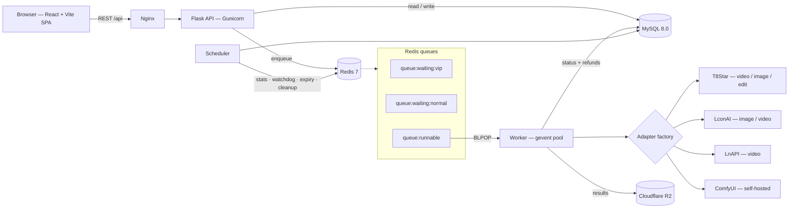

<div align="center">

# Mirage

**Open-source AIGC platform for text-to-video and text-to-image generation.**

A self-hostable multi-provider AI gateway with a built-in credits economy, weighted API-key pool, and a full admin console — so you can turn upstream generation APIs into a running product instead of a script.

[](./LICENSE)
[](https://www.python.org/)
[](https://flask.palletsprojects.com/)
[](https://react.dev/)
[](https://www.typescriptlang.org/)
[](https://vite.dev/)
[](https://docs.docker.com/compose/)

[中文文档](./README.zh-CN.md) · [Deployment Guide](./docs/DEPLOYMENT.md)

</div>

<!-- Add screenshots or a demo GIF here -->

---

## Why Mirage

Wiring up a single image or video generation API is a weekend project. Running it as a service is not — you immediately need key rotation, concurrency ceilings, a queue that survives restarts, billing that refunds correctly when the upstream fails, and somewhere for an operator to see what is going on.

Mirage is the part in between. It sits in front of commercial generation providers and handles:

- **One frontend, many providers.** An adapter layer normalizes differing request shapes, polling strategies, and model naming, so adding a provider does not touch the UI.
- **Keys as a managed pool.** Multiple keys per model, weighted selection, per-key concurrency ceilings, and automatic cooldown when a key starts returning 401/403/429.
- **A queue tied to real capacity.** Tasks wait when no key is free and dispatch the instant one is released — tier-priority first, not round-robin.
- **Billing that does not leak money.** Credits are deducted up front and refunded automatically when a job fails for a reason that was not the user's fault.
- **An operator's view.** Users, credits, models, key pool, redeem codes, campaigns, and announcements are all editable at runtime without a redeploy.

If you are building an AI SaaS, an internal generation tool, or a community site around video and image models, this is a working starting point rather than a template.

> **Project status.** Mirage is actively developed and runs in production, but it is not a polished turnkey product. The UI is **Simplified Chinese only** — there is no i18n layer yet. A few routes are placeholders; see [Roadmap](#roadmap) for exactly which. Everything documented below is implemented.

---

## Features

### Generation studio

| Surface | What it does |
|---|---|
| **Video generation** | Text-to-video and image-to-video with reference-image input, per-model parameter controls, live progress, and a history drawer |
| **Image generation** | Text-to-image and image editing, multi-reference input, batch output |
| **Workflows** | Submits jobs to a self-hosted ComfyUI cluster for pipelines that commercial APIs do not cover |
| **Prompt gallery** | A browsable library of curated prompts with bilingual (EN/ZH) text and preview media, one click to reuse |

Which models appear on which page is driven by a `tags` array on each model record, so a new model shows up in the right studio without a frontend change.

### Multi-provider gateway

An adapter per provider-and-capability, selected at dispatch time by matching the key's `api_base` host and path plus the model name. Each adapter owns its own request shape, status-polling URL, timeout, and poll interval.

Also handled at this layer:

- **Model-name translation** — platform-facing names are mapped to the provider's actual model IDs, including resolution-dependent variants.
- **Split submit/status hosts** — an `api_base` may be written as `submit_url|status_base` for providers whose endpoints differ.
- **Synchronous vs. asynchronous** — adapters declare which they are; the worker either returns immediately or enters a polling loop.
- **Error sanitization** — upstream URLs are stripped from failure messages before they reach a user, so provider identities are not exposed.

### API key pool

- Many keys per model and many models per key, through a join table that allows a **different `api_base` per key-model pair**
- Weighted selection (1–100) for gradual rollout or cost steering
- Per-key concurrency ceilings enforced with Redis counters
- Automatic circuit-breaker cooldown on auth and rate-limit errors
- Call and error counters buffered in Redis and flushed to MySQL every 5 minutes
- A watchdog that detects and recovers queue deadlock every minute

### Credits, tiers, and campaigns

- **Dual-balance economy** — purchased credits (with an expiry date) are tracked separately from earned credits (tracked as individual FIFO-expiring lots), with scheduled jobs expiring each on its own cadence
- **T1–T5 membership tiers** — each defines a concurrency limit, queue weight, and price; models are gated per tier via an allow-list
- **Priority queueing** — higher tiers occupy a VIP queue that drains before the normal one
- **Pre-deduct and auto-refund** — a failure is classified against a content-policy keyword list; policy violations are the user's cost, everything else is refunded automatically
- **Redeem codes (CDK)** — single-use or universal, batch-generated, expiring, optionally granting a tier upgrade; redemption takes a row lock so a code cannot be spent twice
- **Campaigns and daily check-in** — configurable claim rules, a 7-day consecutive check-in reward table, and per-user claim caps
- **Full ledger** — every balance movement is recorded with its type, which pocket moved, and the resulting balance

### Admin console

A separate React app behind a role guard, covering: dashboard with charts, user management and manual balance adjustment, redeem-code generation, API key pool with live stats and manual cooldown, model catalog, per-model pricing and tier policy, membership tier configuration, campaigns and check-in rules, the prompt-gallery asset library, and site announcements.

### Security and operations

- **Single-session mutex** — a login writes its JWT to Redis as the only valid token for that account, so signing in elsewhere silently invalidates the previous session
- **GeeTest v4 CAPTCHA** — HMAC-SHA256 server-side validation on registration and login
- **bcrypt** password hashing, JWT auth, CORS
- **Crash recovery** — on restart the worker inspects in-flight tasks, resumes polling where an upstream job ID exists, and refunds where it does not
- **Scheduled maintenance** — stats sync, queue watchdog, credit expiry, and cleanup of tasks and their stored files after 3 days
- **Graceful degradation** — storage calls return a structured error instead of crashing when object storage is unconfigured
- **Backend test suite** — 24 pytest modules across models, services, API, and utilities

---

## Architecture



**Dispatch path.** A submission validates the caller's tier, balance, and concurrency, deducts credits, then asks the key manager for a key. If one is free the task goes straight to `queue:runnable`; otherwise it waits in the VIP or normal queue by tier. The worker `BLPOP`s from `queue:runnable`, picks an adapter, submits upstream, and polls for async jobs. When the task finishes, releasing the key immediately promotes the next waiting task — the queue is **event-driven off key release**, not timer-driven.

> The queue is a purpose-built Redis-list implementation, not Celery or RQ. It is deliberately small so that the interaction between tier priority, per-key concurrency, and refund-on-failure stays readable.

---

## Tech stack

**Backend** — Python 3.11 · Flask 3.0 · SQLAlchemy 2.0 · Flask-Migrate (Alembic) · Flask-JWT-Extended · Flask-Mail · PyMySQL · redis-py · gevent · Gunicorn · boto3 (S3-compatible) · bcrypt · pytest

**Frontend** — React 19 · TypeScript 5.9 · Vite 7 · Tailwind CSS 3.4 · shadcn/ui on Radix UI · TanStack Query · TanStack Table · Zustand · React Router 6 · React Hook Form + Zod · Recharts · Sonner · MSW (dev mocking)

**Infrastructure** — MySQL 8.0 · Redis 7 · Cloudflare R2 · Docker Compose · Nginx

---

## Quick start

### Requirements

Docker Engine 20.10+ with Compose v2. For frontend development, Node.js 18+.

### 1. Backend

```bash
git clone https://github.com/Wenyari/Mirage.git
cd Mirage/backend

cp .env.example .env
```

Edit `.env`. At minimum set `SECRET_KEY`, `JWT_SECRET_KEY`, the `MYSQL_*` and `REDIS_PASSWORD` values, and **`ADMIN_PASSWORD`** — database initialization aborts if the admin password is unset, by design. Generate secrets with:

```bash
python -c "import secrets; print(secrets.token_urlsafe(32))"
```

Then bring the stack up:

```bash
docker-compose up -d --build
curl http://127.0.0.1:5000/health
```

This starts MySQL, Redis, the API, the worker, the scheduler, and phpMyAdmin. The entrypoint waits for MySQL, then seeds the schema **only if the database is empty**.

### 2. Frontend

```bash
cd ../frontend
npm install
cp .env.example .env.local
npm run dev
```

Only public identifiers belong in `.env.local` — every `VITE_`-prefixed variable is compiled into the browser bundle.

### 3. Sign in

- User app — http://localhost:5173
- Admin console — http://localhost:5173/wadminw/login

Use the `ADMIN_EMAIL` / `ADMIN_PASSWORD` you configured. There are no hardcoded default credentials.

### 4. Add an upstream key

In the admin console open **Key Pool**, add a key with its `api_base` and secret, and attach it to the models it can serve. Until at least one healthy key exists for a model, tasks for that model will sit in the waiting queue.

Full instructions, production hardening, Nginx setup, and troubleshooting are in the **[Deployment Guide](./docs/DEPLOYMENT.md)**.

---

## Supported providers and models

Providers are resolved from the key's `api_base`, so the catalog is configuration rather than code. Adapters currently ship for:

| Provider | Capabilities | Mode |
|---|---|---|
| **T8Star / BLTCY** | Video generation, image generation, image editing | Video async, image synchronous |
| **LconAI** | Image generation, video generation | Image synchronous, video async |
| **LnAPI** | Video generation | Async |
| **Self-hosted ComfyUI** | Custom workflow pipelines | Async, round-robin across nodes |

The default catalog seeded by `init_db.py`:

- **Video** — `sora-2`, `sora-2-pro`, `veo3.1`, `veo3.1-pro`
- **Image** — `sora_image`, `gpt-4o-image`, `nano-banana`, `nano-banana-2`

Models are stored in the database and edited from the admin console — add, rename, price, tag, and tier-gate them at runtime. Adding a provider means dropping one adapter class into `backend/app/adapters/` and registering it in the factory.

---

## Project structure

```
Mirage/
├── backend/
│   ├── app/
│   │   ├── api/             # Blueprints: auth, users, tasks, wallet,
│   │   │   └── admin/       #   activities, models, upload, announcements
│   │   ├── adapters/        # One adapter per provider capability + factory
│   │   ├── models/          # SQLAlchemy models
│   │   ├── services/        # Task, key manager, pay, storage, auth
│   │   ├── utils/           # Decorators, JWT helpers, CAPTCHA
│   │   └── workflows/       # ComfyUI workflow definitions
│   ├── migrations/          # Alembic + standalone upgrade scripts
│   ├── tests/               # pytest suite
│   ├── worker.py            # Reference single-threaded worker
│   ├── worker_gevent.py     # Production worker (gevent pool)
│   ├── scheduler.py         # Periodic jobs
│   ├── init_db.py           # Schema + seed data
│   └── docker-compose.yml
├── frontend/
│   └── src/
│       ├── pages/           # User pages + admin/ console
│       ├── components/      # shadcn/ui primitives + feature components
│       ├── services/        # API clients
│       ├── store/           # Zustand stores
│       └── config/routes.tsx
└── docs/
    ├── DEPLOYMENT.md
    └── nginx.conf.example
```

---

## API overview

REST under `/api`, JWT bearer auth. `GET /health` is unauthenticated.

| Group | Prefix | Highlights |
|---|---|---|
| Auth | `/api/auth` | `POST /code`, `POST /register`, `POST /login`, `POST /logout`, `GET /me`, `GET /stats/public` |
| Users | `/api/users` | `GET /me`, `PATCH /me`, `GET /membership/plans` |
| Tasks | `/api/tasks` | `POST /` submit · `GET /<id>` status · `POST /<id>/cancel` · `GET /` history · `DELETE /<id>` · `GET /queue/status` · `GET /models` |
| Wallet | `/api/wallet` | `POST /redeem`, `GET /balance`, `GET /transactions` |
| Activities | `/api/activities` | `POST /claim`, `POST /checkin`, `GET /checkin/status`, `GET /my-claims`, `GET /list` |
| Models | `/api/models` | `GET /` — catalog with per-tier availability, works anonymously |
| Upload | `/api/upload` | `POST /file`, `POST /files`, `DELETE /delete/<key>` |
| Announcements | `/api` | `GET /announcements` |
| Admin | `/api/admin` | Dashboard, users, CDK, models, key pool, model configs, membership config, activities, media assets, announcements |

---

## Roadmap

Honest list of what is scaffolded but not built:

- [ ] **Chat playground** — `/playground/chat` is a placeholder; no conversational backend exists yet
- [ ] **Agents** — `/explore/agents` is a placeholder
- [ ] **User-facing API keys** — letting users call the platform programmatically; the settings page is a placeholder
- [ ] **Help center** — placeholder page
- [ ] **Admin sandbox** — an in-console request playground; placeholder page
- [ ] **i18n** — the UI is currently Simplified Chinese only
- [ ] **Dark mode for the user app** — the admin console has a working toggle; the user side has none, and `dark:` coverage is thin
- [ ] **Configurable timezone** — currently hardcoded to `Asia/Shanghai`
- [ ] **Rate limiting** — a decorator exists but is not applied to any route
- [ ] **CI** — no workflows yet
- [ ] **Frontend tests**

---

## Contributing

Issues and pull requests are welcome.

- Keep changes focused — one concern per PR.
- Backend: match the existing service/adapter layering, and run `pytest` before opening a PR.
- Frontend: `npm run build` type-checks with `tsc --noEmit` and will fail on any type error; `npm run lint` must pass.
- Adding a provider: implement an adapter in `backend/app/adapters/`, register it in `adapter_factory.py`, and note the expected `api_base` shape in the PR description.
- Never commit secrets. `.env` is gitignored; put placeholders in `.env.example`.

---

## Security

Do not open a public issue for a security problem — report it privately through GitHub's [security advisory](https://github.com/Wenyari/Mirage/security/advisories/new) flow.

If you self-host, at minimum: set strong `SECRET_KEY` and `JWT_SECRET_KEY` values, configure `GEETEST_ID` / `GEETEST_KEY` (CAPTCHA verification is skipped when they are empty), keep MySQL and Redis bound to localhost, and do not expose phpMyAdmin.

---

## License

[MIT](./LICENSE)

---

<div align="center">

**Keywords** — AIGC platform · text-to-video · text-to-image · AI video generator · AI image generator · multi-model AI gateway · LLM API gateway · AI SaaS boilerplate · self-hosted AI platform · API key pool · load balancing · credits system · membership tiers · admin dashboard · Sora · Veo · Nano Banana · ComfyUI · Flask · React · TypeScript · MySQL · Redis · Docker

If Mirage is useful to you, a ⭐ helps others find it.

</div>
