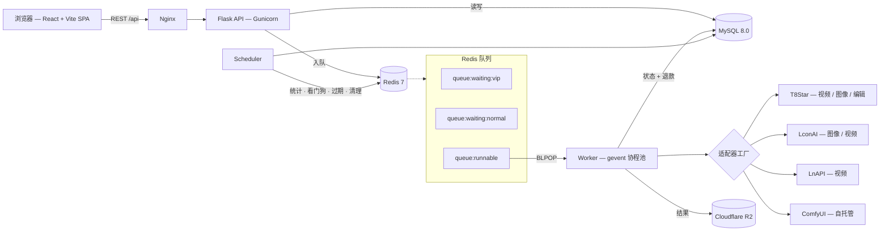

<div align="center">

# Mirage

**开源 AIGC 平台，专注文生视频与文生图。**

一套可自托管的多供应商 AI 网关，内置积分体系、加权 API Key 池和完整管理后台 —— 把上游生成接口变成一个能跑起来的产品，而不是一个脚本。

[](./LICENSE)
[](https://www.python.org/)
[](https://flask.palletsprojects.com/)
[](https://react.dev/)
[](https://www.typescriptlang.org/)
[](https://vite.dev/)
[](https://docs.docker.com/compose/)

[English](./README.md) · [部署文档](./docs/DEPLOYMENT.md)

</div>

<!-- 在这里补充截图或演示 GIF -->

---

## 为什么做 Mirage

接通一个图像或视频生成接口，是个周末就能做完的事；把它当作服务跑起来，不是。一上线你立刻会需要：密钥轮换、并发上限、重启后还能恢复的队列、上游失败时能正确退款的计费，以及一个让运营看得见发生了什么的地方。

Mirage 就是中间这一层。它挡在商业生成供应商前面，负责：

- **一个前端，多个供应商。** 适配层抹平各家不同的请求结构、轮询策略和模型命名，新增供应商不需要动 UI。
- **密钥按池管理。** 单模型多密钥、加权选择、单密钥并发上限，密钥开始返回 401/403/429 时自动进入冷却。
- **队列与真实容量绑定。** 没有空闲密钥时任务排队，密钥一释放立刻派发 —— 按会员等级优先，而不是简单轮转。
- **计费不漏钱。** 积分先扣后用，任务失败且责任不在用户时自动退款。
- **运营视角。** 用户、积分、模型、密钥池、兑换码、活动、公告全部可在运行时修改，无需重新部署。

如果你要做 AI SaaS、内部生成工具，或者围绕视频和图像模型的社区站点，这是一个能跑的起点，而不是一个模板。

> **项目状态。** Mirage 在持续开发并已用于生产，但它不是一个开箱即用的成品。界面**目前仅简体中文**，尚无 i18n 层。少数路由是占位页，具体哪些见 [Roadmap](#roadmap)。下文描述的功能均已实现。

---

## 功能

### 生成工作台

| 页面 | 能力 |
|---|---|
| **视频生成** | 文生视频与图生视频，支持参考图输入、按模型的参数控制、实时进度、历史抽屉 |
| **图像生成** | 文生图与图像编辑，多参考图输入，批量出图 |
| **工作流** | 把任务投递到自托管 ComfyUI 集群，覆盖商业接口做不到的流水线 |
| **提示词广场** | 可浏览的精选提示词库，中英双语文案 + 预览素材，一键复用 |

模型出现在哪个页面由模型记录上的 `tags` 数组决定，新增模型不改前端即可落到正确的工作台。

### 多供应商网关

每个「供应商 × 能力」一个适配器，派发时按密钥的 `api_base` 主机名、路径以及模型名匹配。每个适配器自带请求结构、状态查询 URL、超时时长和轮询间隔。

这一层还处理：

- **模型名翻译** —— 平台侧模型名映射到供应商真实模型 ID，含按分辨率区分的变体。
- **提交/查询分离** —— `api_base` 可写成 `submit_url|status_base`，适配提交与查询不同域的供应商。
- **同步与异步** —— 适配器自行声明，Worker 据此决定直接返回还是进入轮询循环。
- **错误脱敏** —— 失败信息在返回用户前剥离上游 URL，不暴露供应商身份。

### API Key 池

- 一个模型多把密钥、一把密钥多个模型，通过关联表支持**每个「密钥-模型」对配置独立 `api_base`**
- 加权选择（1–100），可用于灰度放量或成本调度
- 单密钥并发上限，用 Redis 计数器强制执行
- 遇到鉴权和限流错误自动熔断冷却
- 调用数与错误数先缓冲在 Redis，每 5 分钟刷入 MySQL
- 每分钟一次看门狗，检测并恢复队列死锁

### 积分、会员与活动

- **双余额体系** —— 充值积分（带过期时间）与活动积分（按 FIFO 逐笔过期）分开记账，两个定时任务按各自节奏过期
- **T1–T5 会员等级** —— 各自定义并发上限、队列权重与价格；模型通过白名单按等级开放
- **优先级队列** —— 高等级用户进 VIP 队列，先于普通队列消费
- **预扣 + 自动退款** —— 失败原因会对照内容策略关键词表分类，违规由用户承担，其余自动退款
- **兑换码（CDK）** —— 一次性或通用，批量生成、可设过期，可附带等级升级；兑换时加行锁，杜绝重复核销
- **活动与每日签到** —— 可配置领取规则、7 天连签奖励表、单用户领取上限
- **完整流水** —— 每一笔余额变动都记录类型、扣的哪个口袋、变动后余额

### 管理后台

独立的 React 应用，由角色守卫保护，覆盖：数据看板（图表）、用户管理与手动改余额、兑换码生成、密钥池实时统计与手动冷却、模型目录、按模型定价与等级策略、会员等级配置、活动与签到规则、提示词素材库、站点公告。

### 安全与运维

- **单点登录互斥** —— 登录时把 JWT 写入 Redis 作为该账号唯一有效令牌，异地登录会静默踢掉前一个会话
- **极验 v4 人机验证** —— 注册与登录均做 HMAC-SHA256 服务端校验
- **bcrypt** 密码哈希、JWT 鉴权、CORS
- **崩溃恢复** —— 重启后 Worker 检查在途任务，有上游任务 ID 的继续轮询，没有的直接退款
- **定时维护** —— 统计同步、队列看门狗、积分过期，以及 3 天后清理任务及其存储文件
- **优雅降级** —— 对象存储未配置时，存储调用返回结构化错误而不是崩溃
- **后端测试** —— 24 个 pytest 模块，覆盖 models、services、API、utils

---

## 架构



**派发链路。** 提交任务时先校验等级、余额与并发，扣减积分，然后向 Key Manager 申请密钥。有空闲密钥则直接进 `queue:runnable`，否则按等级进 VIP 或普通等待队列。Worker 从 `queue:runnable` 做 `BLPOP`，选适配器、提交上游、异步任务进入轮询。任务结束释放密钥时立即提升下一个等待任务 —— 队列是**由密钥释放事件驱动**的，不是定时器驱动。

> 队列是基于 Redis List 手写的，不是 Celery 也不是 RQ。刻意做小，是为了让「等级优先 × 单密钥并发 × 失败退款」这三者的交互保持可读。

---

## 技术栈

**后端** —— Python 3.11 · Flask 3.0 · SQLAlchemy 2.0 · Flask-Migrate（Alembic）· Flask-JWT-Extended · Flask-Mail · PyMySQL · redis-py · gevent · Gunicorn · boto3（S3 兼容）· bcrypt · pytest

**前端** —— React 19 · TypeScript 5.9 · Vite 7 · Tailwind CSS 3.4 · shadcn/ui（基于 Radix UI）· TanStack Query · TanStack Table · Zustand · React Router 6 · React Hook Form + Zod · Recharts · Sonner · MSW（开发期 Mock）

**基础设施** —— MySQL 8.0 · Redis 7 · Cloudflare R2 · Docker Compose · Nginx

---

## 快速开始

### 环境要求

Docker Engine 20.10+ 和 Compose v2。前端开发另需 Node.js 18+。

### 1. 后端

```bash
git clone https://github.com/Wenyari/Mirage.git
cd Mirage/backend

cp .env.example .env
```

编辑 `.env`。至少要设置 `SECRET_KEY`、`JWT_SECRET_KEY`、`MYSQL_*`、`REDIS_PASSWORD`，以及 **`ADMIN_PASSWORD`** —— 未设置管理员密码时数据库初始化会直接中止，这是有意为之。密钥生成：

```bash
python -c "import secrets; print(secrets.token_urlsafe(32))"
```

然后启动：

```bash
docker-compose up -d --build
curl http://127.0.0.1:5000/health
```

这会拉起 MySQL、Redis、API、Worker、Scheduler 和 phpMyAdmin。入口脚本会等待 MySQL 就绪，**仅在数据库为空时**才初始化表结构。

### 2. 前端

```bash
cd ../frontend
npm install
cp .env.example .env.local
npm run dev
```

`.env.local` 只放公开标识 —— 所有 `VITE_` 前缀的变量都会被打进浏览器产物。

### 3. 登录

- 用户端 —— http://localhost:5173
- 管理后台 —— http://localhost:5173/wadminw/login

使用你配置的 `ADMIN_EMAIL` / `ADMIN_PASSWORD`。项目不含任何硬编码默认口令。

### 4. 添加上游密钥

进管理后台的 **密钥池**，填入 `api_base` 和密钥，关联到它能服务的模型。在某个模型至少有一把健康密钥之前，该模型的任务会一直停在等待队列。

完整步骤、生产环境加固、Nginx 配置和排障请看 **[部署文档](./docs/DEPLOYMENT.md)**。

---

## 支持的供应商与模型

供应商由密钥的 `api_base` 决定，所以模型目录属于配置而非代码。目前已有的适配器：

| 供应商 | 能力 | 模式 |
|---|---|---|
| **T8Star / 柏拉图** | 视频生成、图像生成、图像编辑 | 视频异步，图像同步 |
| **LconAI** | 图像生成、视频生成 | 图像同步，视频异步 |
| **LnAPI** | 视频生成 | 异步 |
| **自托管 ComfyUI** | 自定义工作流流水线 | 异步，节点间轮转 |

`init_db.py` 预置的默认模型目录：

- **视频** —— `sora-2`、`sora-2-pro`、`veo3.1`、`veo3.1-pro`
- **图像** —— `sora_image`、`gpt-4o-image`、`nano-banana`、`nano-banana-2`

模型存在数据库里，由管理后台维护 —— 运行时即可新增、改名、定价、打标签、按等级开放。新增供应商只需在 `backend/app/adapters/` 放一个适配器类并在工厂里注册。

---

## 目录结构

```
Mirage/
├── backend/
│   ├── app/
│   │   ├── api/             # 蓝图：auth、users、tasks、wallet、
│   │   │   └── admin/       #   activities、models、upload、announcements
│   │   ├── adapters/        # 每个供应商能力一个适配器 + 工厂
│   │   ├── models/          # SQLAlchemy 模型
│   │   ├── services/        # 任务、密钥管理、支付、存储、鉴权
│   │   ├── utils/           # 装饰器、JWT 辅助、人机验证
│   │   └── workflows/       # ComfyUI 工作流定义
│   ├── migrations/          # Alembic + 独立升级脚本
│   ├── tests/               # pytest 测试
│   ├── worker.py            # 单线程参考实现
│   ├── worker_gevent.py     # 生产 Worker（gevent 协程池）
│   ├── scheduler.py         # 定时任务
│   ├── init_db.py           # 建表 + 种子数据
│   └── docker-compose.yml
├── frontend/
│   └── src/
│       ├── pages/           # 用户页面 + admin/ 后台
│       ├── components/      # shadcn/ui 原子组件 + 业务组件
│       ├── services/        # API 客户端
│       ├── store/           # Zustand
│       └── config/routes.tsx
└── docs/
    ├── DEPLOYMENT.md
    └── nginx.conf.example
```

---

## 接口概览

REST 接口挂在 `/api` 下，JWT Bearer 鉴权。`GET /health` 无需鉴权。

| 分组 | 前缀 | 主要接口 |
|---|---|---|
| 认证 | `/api/auth` | `POST /code`、`POST /register`、`POST /login`、`POST /logout`、`GET /me`、`GET /stats/public` |
| 用户 | `/api/users` | `GET /me`、`PATCH /me`、`GET /membership/plans` |
| 任务 | `/api/tasks` | `POST /` 提交 · `GET /<id>` 状态 · `POST /<id>/cancel` · `GET /` 历史 · `DELETE /<id>` · `GET /queue/status` · `GET /models` |
| 钱包 | `/api/wallet` | `POST /redeem`、`GET /balance`、`GET /transactions` |
| 活动 | `/api/activities` | `POST /claim`、`POST /checkin`、`GET /checkin/status`、`GET /my-claims`、`GET /list` |
| 模型 | `/api/models` | `GET /` —— 带等级可用性的目录，支持匿名访问 |
| 上传 | `/api/upload` | `POST /file`、`POST /files`、`DELETE /delete/<key>` |
| 公告 | `/api` | `GET /announcements` |
| 管理 | `/api/admin` | 看板、用户、CDK、模型、密钥池、模型配置、会员配置、活动、素材、公告 |

---

## Roadmap

如实列出已搭好架子但还没做的部分：

- [ ] **对话工作台** —— `/playground/chat` 是占位页，尚无对话后端
- [ ] **Agents** —— `/explore/agents` 是占位页
- [ ] **用户侧 API Key** —— 让用户以编程方式调用平台；设置页目前是占位
- [ ] **帮助中心** —— 占位页
- [ ] **后台沙箱** —— 后台内置请求调试台；占位页
- [ ] **i18n** —— 界面目前仅简体中文
- [ ] **用户端暗色模式** —— 管理后台已有可用开关，用户端没有，且 `dark:` 覆盖很薄
- [ ] **时区可配置** —— 目前硬编码为 `Asia/Shanghai`
- [ ] **限流** —— 装饰器已实现但未挂到任何路由
- [ ] **CI** —— 尚无工作流
- [ ] **前端测试**

---

## 贡献

欢迎提 Issue 和 PR。

- 改动保持聚焦，一个 PR 只做一件事。
- 后端：遵循现有的 service / adapter 分层，提 PR 前跑一遍 `pytest`。
- 前端：`npm run build` 会先跑 `tsc --noEmit` 类型检查，有类型错误直接失败；`npm run lint` 也要通过。
- 新增供应商：在 `backend/app/adapters/` 实现适配器，在 `adapter_factory.py` 注册，并在 PR 描述里说明期望的 `api_base` 形态。
- 绝不提交密钥。`.env` 已被 gitignore，示例值请写进 `.env.example`。

---

## 安全

安全问题请勿提公开 Issue，通过 GitHub 的 [security advisory](https://github.com/Wenyari/Mirage/security/advisories/new) 私下上报。

自托管时至少做到：设置强随机的 `SECRET_KEY` 和 `JWT_SECRET_KEY`；配置 `GEETEST_ID` / `GEETEST_KEY`（两者为空时人机验证会被整体跳过）；MySQL 和 Redis 只监听本地；不要把 phpMyAdmin 暴露到公网。

---

## 许可证

[MIT](./LICENSE)

---

<div align="center">

**关键词** —— AIGC 平台 · 文生视频 · 文生图 · AI 视频生成 · AI 绘画 · 多模型网关 · AI SaaS 脚手架 · 自托管 AI 平台 · API Key 池 · 负载均衡 · 积分体系 · 会员等级 · 管理后台 · Sora · Veo · Nano Banana · ComfyUI · Flask · React · TypeScript · MySQL · Redis · Docker

如果 Mirage 对你有用，点个 ⭐ 能帮到更多人找到它。

</div>
