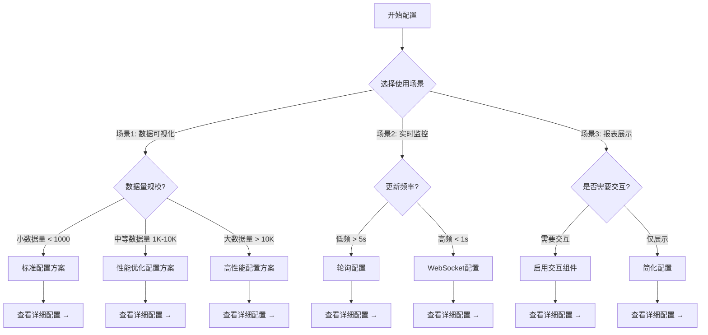

### **配置手册 - 决策树模板**

### **简要说明**

通过交互式决策树引导用户完成复杂的配置任务，帮助用户理解配置选项、做出正确的选择、避免配置错误。

### **章节定位**

本模板帮助用户：
- 理解不同场景下的配置需求
- 做出符合业务场景的配置选择
- 避免常见的配置错误
- 快速实现特定功能场景

### **适用场景**

- 组件功能配置（图表类型、交互功能、样式主题等）
- 系统环境配置（开发环境、测试环境、生产环境等）
- 性能优化配置（数据量大小、渲染性能、缓存策略等）
- 集成配置（与其他系统集成、插件配置等）

---

## **内容结构**

### 1. 配置概述

#### 配置目标
说明本配置手册要解决什么问题，例如：
- 配置 XXX 图表组件
- 设置 XXX 环境
- 优化 XXX 性能

#### 前置条件
列出配置前需要准备的内容：
- 已安装的依赖
- 必需的环境变量
- 相关文档链接

---

### 2. 决策树导航

#### 方式A：Mermaid 可视化决策树



#### 方式B：文本形式决策树

```
配置决策流程：

1. 你的使用场景是什么？
   ├─ A. 数据可视化 → 前往步骤 2
   ├─ B. 实时监控 → 前往步骤 3
   └─ C. 报表展示 → 前往步骤 4

2. [数据可视化] 数据量规模？
   ├─ 小数据量 (< 1000条) → 使用 [标准配置方案](#标准配置方案)
   ├─ 中等数据量 (1K-10K) → 使用 [性能优化方案](#性能优化配置方案)
   └─ 大数据量 (> 10K) → 使用 [高性能方案](#高性能配置方案)

3. [实时监控] 数据更新频率？
   ├─ 低频 (>5秒) → 使用 [轮询配置](#轮询配置)
   └─ 高频 (<1秒) → 使用 [WebSocket配置](#websocket配置)

4. [报表展示] 是否需要用户交互？
   ├─ 需要交互 → 使用 [交互式配置](#交互式配置)
   └─ 仅展示 → 使用 [简化配置](#简化配置)
```

---

### 3. 各配置方案详细说明

为每个决策路径提供详细的配置指南：

#### 标准配置方案

**适用场景**：小数据量数据可视化

**配置步骤**：
1. 基础配置
   ```javascript
   const config = {
     // 核心配置项
     chartType: 'bar',
     data: yourData,
     // 其他配置...
   }
   ```

2. 关键参数说明

   | 参数 | 类型 | 默认值 | 说明 |
   |------|------|--------|------|
   | `chartType` | String | `'bar'` | 图表类型 |
   | `data` | Array | `[]` | 数据源 |
   | `animation` | Boolean | `true` | 是否启用动画 |

3. 验证配置
   - [ ] 图表正常渲染
   - [ ] 数据正确显示
   - [ ] 交互功能正常

4. 相关文档
   - [完整API文档链接](#)
   - [示例代码库链接](#)

---

#### 性能优化配置方案

**适用场景**：中等数据量，需要优化渲染性能

**配置步骤**：
1. 在标准配置基础上添加优化选项
   ```javascript
   const config = {
     // 继承标准配置
     ...standardConfig,

     // 性能优化
     progressive: true,
     progressiveThreshold: 3000,
     large: true,
   }
   ```

2. 性能参数对照表

   | 参数 | 推荐值 | 作用 |
   |------|--------|------|
   | `progressive` | `true` | 渐进式渲染 |
   | `progressiveThreshold` | `3000` | 渐进渲染阈值 |
   | `large` | `true` | 大数据模式 |

3. 性能验证
   - [ ] 首屏渲染时间 < 1s
   - [ ] 交互响应时间 < 200ms
   - [ ] 内存占用稳定

---

### 4. 常见问题决策

#### 问题：配置后图表不显示

```
诊断流程：
├─ 检查容器是否存在？
│  ├─ 否 → 创建容器元素
│  └─ 是 → 继续
├─ 检查数据格式是否正确？
│  ├─ 否 → 修正数据格式，参考 [数据格式文档](#)
│  └─ 是 → 继续
└─ 检查配置项是否冲突？
   ├─ 是 → 调整冲突配置
   └─ 否 → 查看控制台错误，提交 issue
```

---

### 5. 配置检查清单

使用以下清单验证配置完整性：

- [ ] **场景匹配**：配置方案符合业务场景
- [ ] **参数完整**：所有必需参数已设置
- [ ] **格式正确**：配置格式符合规范
- [ ] **功能验证**：核心功能正常运行
- [ ] **性能达标**：满足性能要求
- [ ] **文档更新**：配置变更已记录

---

### 6. 快速参考表

#### 场景 → 配置方案映射

| 使用场景 | 数据规模 | 更新频率 | 推荐方案 | 配置复杂度 |
|---------|---------|---------|---------|-----------|
| 数据可视化 | 小 | - | 标准配置 | ⭐ |
| 数据可视化 | 中 | - | 性能优化配置 | ⭐⭐ |
| 数据可视化 | 大 | - | 高性能配置 | ⭐⭐⭐ |
| 实时监控 | - | 低频 | 轮询配置 | ⭐⭐ |
| 实时监控 | - | 高频 | WebSocket配置 | ⭐⭐⭐ |
| 报表展示 | - | - | 简化配置 | ⭐ |

---

### 7. 附加资源

- 📖 [完整API文档](#)
- 💡 [配置示例集合](#)
- 🐛 [常见问题FAQ](#)
- 📝 [最佳实践指南](#)

---

### 元数据

- **模板版本**：v1.0
- **最后更新**：{UPDATE_DATE}
- **适用产品**：{PRODUCT_NAME}
- **维护者**：{MAINTAINER}
