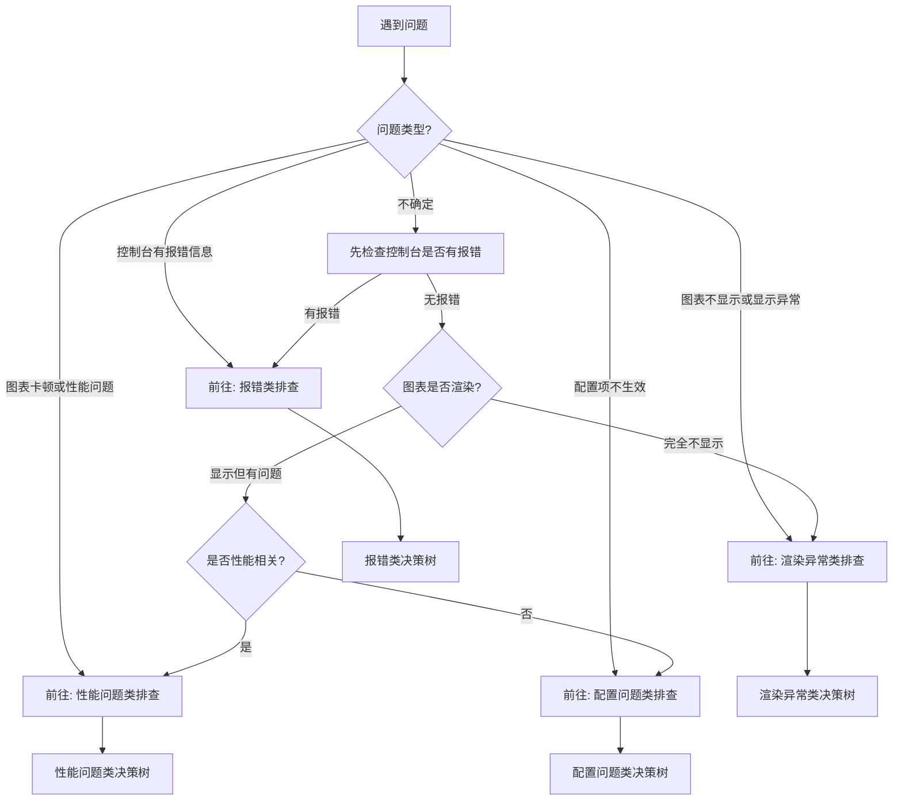
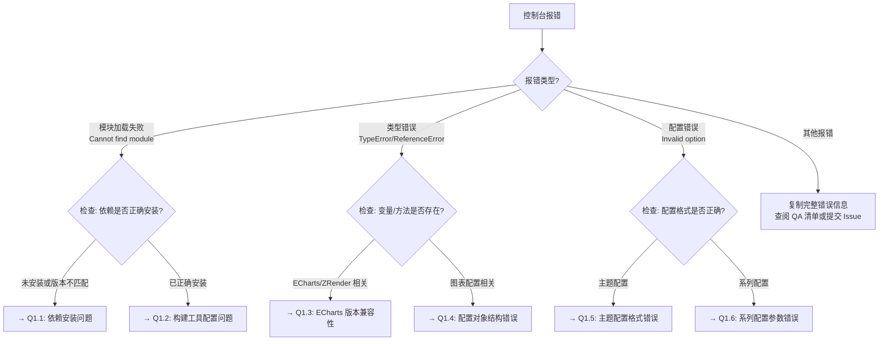
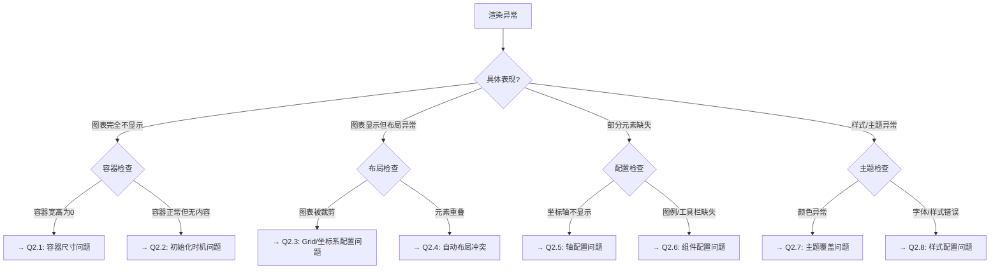
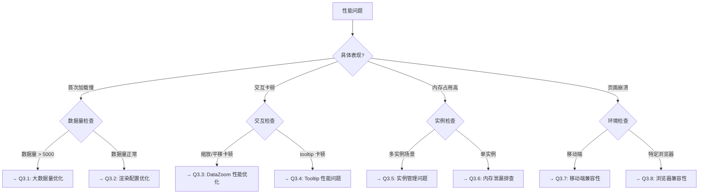
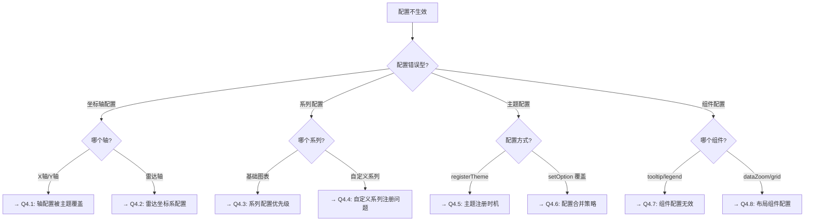

# 可视化库问题排查指南

## 如何使用本文档

本文档旨在帮助可视化库使用者快速定位和解决问题。文档包含两部分：

1. **问题排查决策树**：通过一系列判断问题，帮助你快速定位问题根源
2. **QA 问题清单**：收录常见问题及其解决方案，可直接查阅

### 推荐使用流程

1. 先按照决策树进行初步排查，确定问题类型
2. 根据决策树的指引，查阅对应的 QA 清单条目
3. 如果问题未解决，按照文档末尾的"提交 Issue 指南"准备信息并提交

---

## 贡献指南

我们欢迎你在解决问题后为本文档做出贡献！

### 如何补充新的问题案例

如果你遇到并解决了文档中未收录的问题，可以通过以下方式贡献：

1. **提交 Pull Request**：
   - Fork 本项目
   - 在对应的问题分类下添加新条目（参考 QA 条目模板）
   - 提交 PR，标题格式：`docs: 添加 QA 条目 - [简短问题描述]`

2. **提交 Issue**：
   - 如果不熟悉 PR 流程，可以创建 Issue
   - 使用标签 `documentation` 和 `qa-contribution`
   - 按照 QA 条目模板提供信息

### QA 条目模板

```markdown
#### Q[分类编号].[序号] [简短问题标题]

**问题描述**：
[详细描述问题的表现形式、触发条件、影响范围]

**根本原因**：
[解释为什么会出现这个问题，涉及的技术原理]

**解决方案**：
[提供具体的修复步骤或配置调整方法]
- 步骤1：...
- 步骤2：...

**相关信息**（可选）：
- 影响版本：v1.x.x - v1.y.y
- 相关 Issue：#123
- 参考文档：[链接]
```

---

## 问题排查决策树

### 主决策流程



---

### 1. 报错类问题排查



---

### 2. 渲染异常类问题排查



---

### 3. 性能问题类排查



---

### 4. 配置问题类排查



---

## QA 问题清单

### 1. 报错类问题

#### Q1.1 依赖安装问题 - Cannot find module 'echarts' or 'zrender'

**问题描述**：
在项目中导入可视化库时，控制台报错：
```
Error: Cannot find module 'echarts'
Error: Cannot find module 'zrender'
```

**根本原因**：
- ECharts 或 ZRender 依赖未正确安装
- 依赖版本与可视化库要求的版本不匹配
- npm/yarn/pnpm 的 lock 文件与实际安装不一致

**解决方案**：
1. 检查 `package.json` 中的依赖版本：
   ```json
   {
     "dependencies": {
       "echarts": "^6.0.0",
       "zrender": "6.0.0"
     }
   }
   ```
2. 重新安装依赖：
   ```bash
   # 删除 node_modules 和 lock 文件
   rm -rf node_modules package-lock.json
   # 重新安装
   npm install
   ```
3. 确认依赖版本是否符合要求（本库要求 echarts ^6.0.0，zrender 6.0.0）

**相关信息**：
- 参考文档：CLAUDE.md "### Key Dependencies" 章节

---

#### Q1.2 构建工具配置问题 - Module parse failed

**问题描述**：
使用 Webpack/Vite/Rollup 构建时报错：
```
Module parse failed: Unexpected token
You may need an appropriate loader to handle this file type
```

**根本原因**：
- 构建工具未正确处理 ES 模块或 TypeScript 文件
- 缺少对 `.js` 扩展名的解析配置
- ZRender/ECharts 的模块路径未正确转换

**解决方案**：

**Webpack 配置：**
```javascript
module.exports = {
  resolve: {
    extensions: ['.js', '.ts', '.tsx'],
    alias: {
      'zrender/src': 'zrender/lib'
    }
  },
  module: {
    rules: [
      {
        test: /\.tsx?$/,
        use: 'ts-loader',
        exclude: /node_modules/
      }
    ]
  }
};
```

**Vite 配置：**
```javascript
export default {
  resolve: {
    alias: {
      'zrender/src': 'zrender/lib'
    }
  },
  optimizeDeps: {
    include: ['echarts', 'zrender']
  }
};
```

**相关信息**：
- 参考文档：CLAUDE.md "### Module Import Management" 章节
- 工具脚本：`node scripts/transformEChartsImports.mjs`

---

#### Q1.3 ECharts 版本兼容性 - TypeError in ECharts/ZRender

**问题描述**：
运行时报错，错误信息涉及 ECharts 或 ZRender 的内部方法：
```
TypeError: Cannot read property 'xxx' of undefined (in echarts/lib/...)
TypeError: chart.getModel is not a function
```

**根本原因**：
- ECharts 版本低于 6.0.0，与本库不兼容
- 同时安装了多个版本的 ECharts，导致版本冲突
- npm/yarn 的依赖解析策略导致安装了错误的版本

**解决方案**：
1. 检查实际安装的 ECharts 版本：
   ```bash
   npm list echarts
   ```
2. 确保版本 ≥ 6.0.0，如果不符合要求：
   ```bash
   npm install echarts@^6.0.0
   ```
3. 清理可能的重复安装：
   ```bash
   npm dedupe
   ```
4. 如果使用 pnpm，检查 `.npmrc` 配置：
   ```ini
   # 确保不使用严格的版本锁定
   strict-peer-dependencies=false
   ```

**相关信息**：
- 最低版本要求：echarts ^6.0.0, zrender 6.0.0

---

#### Q1.4 配置对象结构错误 - Invalid chart option

**问题描述**：
调用 `setOption()` 时报错：
```
TypeError: Cannot read property 'type' of undefined
Error: Invalid series configuration
```

**根本原因**：
- 配置对象的结构不符合 ECharts 规范
- 必填字段缺失（如 `series.type`）
- 配置项的数据类型错误（如应为数组却传了对象）

**解决方案**：
1. 检查基本结构是否完整：
   ```javascript
   const option = {
     // 必须的配置
     series: [{
       type: 'bar',  // type 是必填字段
       data: [1, 2, 3]
     }]
   };
   ```
2. 验证数组类型的配置：
   ```javascript
   // ❌ 错误：series 应该是数组
   series: { type: 'bar', data: [] }

   // ✅ 正确：series 是数组
   series: [{ type: 'bar', data: [] }]
   ```
3. 使用 TypeScript 获得类型提示（推荐）

**相关信息**：
- ECharts 配置项文档：https://echarts.apache.org/zh/option.html

---

#### Q1.5 主题配置格式错误 - Theme registration failed

**问题描述**：
注册或使用主题时报错：
```
Error: Theme 'xxx' not registered
TypeError: Cannot read property of theme object
```

**根本原因**：
- 主题对象格式不正确
- 主题注册时机错误（在图表初始化之后）
- 主题名称拼写错误或未正确引入

**解决方案**：
1. 检查主题的引入和注册顺序：
   ```javascript
   import * as echarts from 'echarts';
   import { installTheme } from 'paradigm-chart';

   // 先注册主题
   installTheme(echarts);

   // 再初始化图表并使用主题
   const chart = echarts.init(container, 'themeName');
   ```
2. 验证主题名称：
   ```javascript
   // 可用的主题名称（示例）
   const availableThemes = [
     'pc-default',
     'mobile-default',
     'ainvest',
     'business'
   ];
   ```
3. 如果使用自定义主题，确保格式正确：
   ```javascript
   echarts.registerTheme('myTheme', {
     color: ['#c23531', '#2f4554'],
     backgroundColor: '#fff',
     // ... 其他配置
   });
   ```

**相关信息**：
- 主题目录：`src/theme/`
- 主题安装：`src/theme/installTheme.ts`

---

#### Q1.6 系列配置参数错误 - Invalid series parameter

**问题描述**：
使用特定系列类型时报错：
```
Error: Unknown series type 'dvRadar'
Warning: Invalid parameter in series configuration
```

**根本原因**：
- 自定义系列类型未正确注册
- 系列特有的配置参数拼写错误或类型不匹配
- 部分系列需要特定的坐标系配置

**解决方案**：
1. 确保自定义系列已注册：
   ```javascript
   // 使用完整引入（推荐）
   import 'paradigm-chart';

   // 或按需引入
   import { installDvRadar } from 'paradigm-chart/charts-advanced';
   installDvRadar(echarts);
   ```
2. 检查系列类型名称：
   ```javascript
   // ❌ 错误：类型名称错误
   series: [{ type: 'radar', ... }]

   // ✅ 正确：使用自定义系列类型
   series: [{ type: 'dvRadar', ... }]
   ```
3. 验证特定系列的必需配置：
   ```javascript
   // dvRadar 需要配合 radar 坐标系
   {
     radar: {
       indicator: [
         { name: '指标1', max: 100 },
         { name: '指标2', max: 100 }
       ]
     },
     series: [{
       type: 'dvRadar',
       data: [/*...*/]
     }]
   }
   ```

**相关信息**：
- 自定义系列目录：`src/extension/series/`
- 系列文档：查看对应系列的 README 或示例

---

### 2. 渲染异常类问题

#### Q2.1 容器尺寸问题 - 图表完全不显示

**问题描述**：
调用 `init()` 和 `setOption()` 后，图表容器区域是空白的，没有任何内容渲染。

**根本原因**：
- 容器的 `width` 或 `height` 为 0
- 容器的 CSS 样式未设置尺寸
- 在容器尺寸确定前就初始化了图表

**解决方案**：
1. 为容器设置明确的尺寸：
   ```html
   <div id="chart" style="width: 600px; height: 400px;"></div>
   ```
   或使用 CSS：
   ```css
   #chart {
     width: 100%;
     height: 400px;
   }
   ```
2. 确保父容器有明确的高度：
   ```css
   /* ❌ 父容器高度未定义，子容器 100% 无效 */
   .parent { }
   .chart { height: 100%; }

   /* ✅ 父容器有明确高度 */
   .parent { height: 500px; }
   .chart { height: 100%; }
   ```
3. 在容器渲染完成后再初始化图表：
   ```javascript
   // React 示例
   useEffect(() => {
     const chart = echarts.init(chartRef.current);
     chart.setOption(option);
   }, []);

   // Vue 示例
   onMounted(() => {
     const chart = echarts.init(chartRef.value);
     chart.setOption(option);
   });
   ```
4. 如果是动态容器，在尺寸变化后调用 `resize()`：
   ```javascript
   window.addEventListener('resize', () => {
     chart.resize();
   });
   ```

---

#### Q2.2 初始化时机问题 - 容器正常但无内容

**问题描述**：
容器尺寸正常，但图表不显示，控制台无报错。

**根本原因**：
- 在 DOM 元素插入文档之前就调用了 `init()`
- 在框架的生命周期中时机选择不当
- 容器元素被异步渲染，但初始化代码同步执行

**解决方案**：
1. **原生 JavaScript**：确保 DOM 加载完成
   ```javascript
   document.addEventListener('DOMContentLoaded', () => {
     const chart = echarts.init(document.getElementById('chart'));
     chart.setOption(option);
   });
   ```

2. **React**：使用 `useEffect` 或 `useLayoutEffect`
   ```javascript
   function ChartComponent() {
     const chartRef = useRef(null);

     useEffect(() => {
       if (chartRef.current) {
         const chart = echarts.init(chartRef.current);
         chart.setOption(option);

         return () => chart.dispose();  // 清理
       }
     }, []);

     return <div ref={chartRef} style={{width: '600px', height: '400px'}} />;
   }
   ```

3. **Vue 3**：使用 `onMounted`
   ```javascript
   <script setup>
   import { ref, onMounted, onUnmounted } from 'vue';

   const chartRef = ref(null);
   let chart = null;

   onMounted(() => {
     chart = echarts.init(chartRef.value);
     chart.setOption(option);
   });

   onUnmounted(() => {
     chart?.dispose();
   });
   </script>

   <template>
     <div ref="chartRef" style="width: 600px; height: 400px;"></div>
   </template>
   ```

4. **异步渲染场景**：使用 `nextTick` 或 `setTimeout`
   ```javascript
   // Vue
   await nextTick();
   const chart = echarts.init(chartRef.value);

   // 通用方案
   setTimeout(() => {
     const chart = echarts.init(container);
     chart.setOption(option);
   }, 0);
   ```

---

#### Q2.3 Grid/坐标系配置问题 - 图表被裁剪

**问题描述**：
图表显示不完整，部分内容被裁剪，例如：
- 坐标轴标签被截断
- 图例超出容器
- 标题或文字显示不全

**根本原因**：
- `grid` 组件的边距设置过小，没有为坐标轴标签预留空间
- 容器尺寸与图表内容不匹配
- 自动布局计算不准确

**解决方案**：
1. 手动设置 `grid` 的边距：
   ```javascript
   option = {
     grid: {
       top: 60,      // 为标题和图例预留空间
       right: 80,    // 为 Y 轴标签预留空间
       bottom: 60,   // 为 X 轴标签预留空间
       left: 80,     // 为 Y 轴标签预留空间
       containLabel: true  // 包含坐标轴标签
     }
   };
   ```
2. 使用 `containLabel` 自动计算：
   ```javascript
   grid: {
     containLabel: true  // 自动计算边距以包含标签
   }
   ```
3. 调整坐标轴标签的旋转角度：
   ```javascript
   xAxis: {
     axisLabel: {
       rotate: 45,  // 倾斜标签以节省空间
       interval: 0  // 显示所有标签
     }
   }
   ```
4. 增加容器尺寸或减少内容密度：
   ```javascript
   // 减少数据密度
   xAxis: {
     axisLabel: {
       interval: 'auto'  // 自动隐藏部分重叠标签
     }
   }
   ```

---

#### Q2.4 自动布局冲突 - 元素重叠

**问题描述**：
多个组件或系列重叠显示，例如：
- 图例与标题重叠
- 多个坐标系重叠
- tooltip 与图表元素重叠

**根本原因**：
- 多个组件使用了相同的定位
- 未为组件指定明确的位置
- 自动布局无法处理复杂场景

**解决方案**：
1. 为组件明确指定位置：
   ```javascript
   option = {
     title: {
       text: '图表标题',
       top: 10,
       left: 'center'
     },
     legend: {
       top: 40,     // 在标题下方
       left: 'center'
     },
     grid: {
       top: 80      // 在图例下方留出空间
     }
   };
   ```
2. 使用多个 grid 布局多个坐标系：
   ```javascript
   option = {
     grid: [
       { top: '10%', height: '35%' },   // 第一个图表
       { top: '55%', height: '35%' }    // 第二个图表
     ],
     xAxis: [
       { gridIndex: 0 },
       { gridIndex: 1 }
     ],
     yAxis: [
       { gridIndex: 0 },
       { gridIndex: 1 }
     ]
   };
   ```
3. 调整 tooltip 的位置：
   ```javascript
   tooltip: {
     position: function (point, params, dom, rect, size) {
       // 自定义位置逻辑，避免遮挡
       return [point[0] + 10, point[1] - 10];
     }
   }
   ```

---

#### Q2.5 轴配置问题 - 坐标轴不显示

**问题描述**：
X 轴或 Y 轴不显示，或者显示位置不正确。

**根本原因**：
- 坐标轴被显式隐藏（`show: false`）
- 坐标轴的数据范围设置不当
- 主题配置覆盖了用户配置
- 系列未正确关联坐标轴

**解决方案**：
1. 确保坐标轴未被隐藏：
   ```javascript
   xAxis: {
     show: true,  // 显式设置为 true
     type: 'category',
     data: ['A', 'B', 'C']
   }
   ```
2. 检查坐标轴的数据范围：
   ```javascript
   yAxis: {
     type: 'value',
     min: 0,          // 不要设置过大的 min
     max: 'dataMax'   // 使用 'dataMax' 自动计算
   }
   ```
3. 覆盖主题配置：
   ```javascript
   xAxis: {
     axisLine: { show: true },      // 显示轴线
     axisTick: { show: true },      // 显示刻度
     axisLabel: { show: true }      // 显示标签
   }
   ```
4. 检查系列与坐标轴的关联：
   ```javascript
   // 多坐标轴场景
   yAxis: [
     { type: 'value' },   // yAxisIndex: 0
     { type: 'value' }    // yAxisIndex: 1
   ],
   series: [
     { yAxisIndex: 0, data: [...] },  // 使用第一个 Y 轴
     { yAxisIndex: 1, data: [...] }   // 使用第二个 Y 轴
   ]
   ```

**相关信息**：
- 已知问题：雷达图的 `radar.radius` 配置可能被主题覆盖（v1.11.2 已修复）
- 参考 Issue：查看 changelog 中关于坐标轴配置的修复记录

---

#### Q2.6 组件配置问题 - 图例/工具栏缺失

**问题描述**：
图例（legend）、工具栏（toolbox）、数据区域缩放（dataZoom）等组件不显示。

**根本原因**：
- 组件未在配置中声明
- 组件被显式隐藏
- 组件的数据源配置错误
- 组件位置超出容器范围

**解决方案**：
1. **图例（Legend）配置**：
   ```javascript
   option = {
     legend: {
       show: true,
       data: ['系列1', '系列2'],  // 必须与 series.name 对应
       top: 10,
       left: 'center'
     },
     series: [
       { name: '系列1', type: 'line', data: [...] },
       { name: '系列2', type: 'bar', data: [...] }
     ]
   };
   ```
2. **工具栏（Toolbox）配置**：
   ```javascript
   toolbox: {
     show: true,
     feature: {
       dataZoom: { show: true },
       restore: { show: true },
       saveAsImage: { show: true }
     }
   }
   ```
3. **数据区域缩放（DataZoom）配置**：
   ```javascript
   dataZoom: [
     {
       type: 'slider',  // 滑动条型
       show: true,
       xAxisIndex: 0,
       start: 0,
       end: 100
     },
     {
       type: 'inside',  // 内置型（鼠标滚轮缩放）
       xAxisIndex: 0
     }
   ]
   ```
4. 检查组件位置是否在容器内：
   ```javascript
   legend: {
     top: 10,    // 不要设置过大的值
     left: 10,
     // 或使用相对定位
     top: '5%',
     left: '10%'
   }
   ```

---

#### Q2.7 主题覆盖问题 - 颜色异常

**问题描述**：
用户配置的颜色没有生效，仍然显示主题的默认颜色。

**根本原因**：
- 主题配置的优先级高于部分用户配置
- 使用 `setOption` 时未使用 `replaceMerge` 参数
- 颜色配置的层级不正确

**解决方案**：
1. 使用 `replaceMerge` 完全替换配置：
   ```javascript
   chart.setOption(option, {
     replaceMerge: ['series']  // 完全替换 series 配置
   });
   ```
2. 在系列级别设置颜色（优先级最高）：
   ```javascript
   series: [{
     type: 'bar',
     itemStyle: {
       color: '#FF5733'  // 直接在系列上设置颜色
     },
     data: [...]
   }]
   ```
3. 覆盖主题的全局颜色配置：
   ```javascript
   option = {
     color: ['#FF5733', '#33FF57', '#3357FF'],  // 全局调色盘
     series: [...]
   };
   ```
4. 不使用主题，或使用自定义主题：
   ```javascript
   // 不使用主题
   const chart = echarts.init(container);

   // 或注册并使用自定义主题
   echarts.registerTheme('myTheme', {
     color: ['#FF5733', '#33FF57']
   });
   const chart = echarts.init(container, 'myTheme');
   ```

**相关信息**：
- 主题目录：`src/theme/`
- 配置合并策略：ECharts 官方文档

---

#### Q2.8 样式配置问题 - 字体/样式错误

**问题描述**：
文字显示模糊、字体不正确、字号过大或过小。

**根本原因**：
- 设备像素比（devicePixelRatio）未正确设置
- 字体配置被主题覆盖
- CSS 样式影响了图表渲染

**解决方案**：
1. 设置正确的 devicePixelRatio：
   ```javascript
   const chart = echarts.init(container, null, {
     devicePixelRatio: window.devicePixelRatio || 1
   });
   ```
2. 统一设置全局文字样式：
   ```javascript
   option = {
     textStyle: {
       fontFamily: 'Arial, sans-serif',
       fontSize: 14
     }
   };
   ```
3. 在具体组件上设置样式：
   ```javascript
   xAxis: {
     axisLabel: {
       fontSize: 12,
       color: '#333',
       fontWeight: 'normal'
     }
   }
   ```
4. 确保容器没有影响渲染的 CSS 样式：
   ```css
   #chart {
     /* ❌ 避免使用 transform，可能导致模糊 */
     /* transform: scale(0.5); */

     /* ✅ 使用标准的尺寸设置 */
     width: 600px;
     height: 400px;
   }
   ```

---

### 3. 性能问题类

#### Q3.1 大数据量优化 - 首次加载慢

**问题描述**：
数据量超过 5000 条时，图表首次渲染耗时过长（>3秒），页面出现卡顿。

**根本原因**：
- ECharts 默认渲染模式（SVG 或 Canvas）不适合大数据量
- 未开启数据采样或聚合
- 动画效果增加了渲染负担

**解决方案**：
1. 使用 Canvas 渲染器（大数据量首选）：
   ```javascript
   const chart = echarts.init(container, null, {
     renderer: 'canvas'  // 默认值，适合大数据量
   });
   ```
2. 开启数据采样：
   ```javascript
   series: [{
     type: 'line',
     sampling: 'lttb',  // Largest-Triangle-Three-Bucket 采样
     data: largeDataArray
   }]
   ```
3. 禁用或简化动画：
   ```javascript
   option = {
     animation: false,  // 完全禁用动画
     // 或减少动画时长
     animationDuration: 300
   };
   ```
4. 使用 dataZoom 分段加载：
   ```javascript
   dataZoom: [{
     type: 'slider',
     start: 0,
     end: 10  // 初始只显示 10% 的数据
   }]
   ```
5. 使用 `large: true` 模式（散点图）：
   ```javascript
   series: [{
     type: 'scatter',
     large: true,          // 开启大规模模式
     largeThreshold: 2000, // 数据量阈值
     data: largeDataArray
   }]
   ```

**相关信息**：
- 性能优化建议：数据量 > 5000 建议开启采样
- 数据量 > 100万 建议使用数据聚合或服务端分页

---

#### Q3.2 渲染配置优化 - 数据量正常但加载慢

**问题描述**：
数据量在 1000-5000 之间，但首次渲染仍然较慢。

**根本原因**：
- 配置项过于复杂（如大量的 markLine、markPoint）
- 使用了性能开销大的特性（如 blur/focus 效果）
- 计算密集型的布局算法（如力导向图）

**解决方案**：
1. 简化 markLine 和 markPoint：
   ```javascript
   // ❌ 避免过多的标记
   markLine: {
     data: Array(100).fill({ type: 'average' })
   }

   // ✅ 只标记关键点
   markLine: {
     data: [{ type: 'average' }, { type: 'max' }]
   }
   ```
2. 按需开启高亮特效：
   ```javascript
   emphasis: {
     focus: 'none',  // 禁用聚焦效果
     blurScope: 'none'
   }
   ```
3. 优化力导向图的迭代次数：
   ```javascript
   series: [{
     type: 'graph',
     layout: 'force',
     force: {
       layoutAnimation: false,  // 禁用布局动画
       initLayout: 'circular',  // 使用更快的初始布局
       repulsion: 100,
       edgeLength: 50
     }
   }]
   ```
4. 延迟加载复杂配置：
   ```javascript
   // 先渲染基础图表
   chart.setOption(basicOption);

   // 延迟添加复杂配置
   setTimeout(() => {
     chart.setOption(advancedOption);
   }, 100);
   ```

---

#### Q3.3 DataZoom 性能优化 - 缩放/平移卡顿

**问题描述**：
使用 dataZoom 进行缩放或平移时，操作响应延迟明显。

**根本原因**：
- 每次缩放都重新计算和渲染全部数据
- 未开启节流（throttle）
- 同时使用了多个 dataZoom 组件

**解决方案**：
1. 开启节流：
   ```javascript
   dataZoom: [{
     type: 'slider',
     throttle: 100,  // 节流延迟（毫秒）
     xAxisIndex: 0
   }]
   ```
2. 使用 `inside` 类型的 dataZoom：
   ```javascript
   dataZoom: [{
     type: 'inside',  // 内置型，性能优于 slider
     xAxisIndex: 0,
     zoomOnMouseWheel: true,
     moveOnMouseMove: true
   }]
   ```
3. 限制缩放范围：
   ```javascript
   dataZoom: [{
     type: 'slider',
     minSpan: 10,  // 最小缩放比例 10%
     maxSpan: 100,
     rangeMode: ['percent', 'percent']
   }]
   ```
4. 禁用实时更新：
   ```javascript
   dataZoom: [{
     type: 'slider',
     realtime: false,  // 拖动时不实时更新
     xAxisIndex: 0
   }]
   ```

---

#### Q3.4 Tooltip 性能问题 - tooltip 卡顿

**问题描述**：
鼠标悬停时，tooltip 显示延迟或导致页面卡顿。

**根本原因**：
- tooltip 的 formatter 函数计算复杂
- 触发频率过高
- 渲染的 DOM 结构复杂

**解决方案**：
1. 简化 formatter 函数：
   ```javascript
   tooltip: {
     formatter: function (params) {
       // ❌ 避免复杂计算
       // const result = complexCalculation(params);

       // ✅ 简单的字符串拼接
       return `${params.name}: ${params.value}`;
     }
   }
   ```
2. 开启节流：
   ```javascript
   tooltip: {
     triggerOn: 'mousemove|click',
     throttle: 50  // 50ms 节流
   }
   ```
3. 使用 `axisPointer` 而非 `item` 触发：
   ```javascript
   tooltip: {
     trigger: 'axis',  // 按轴触发，而非按数据项
     axisPointer: {
       type: 'cross'
     }
   }
   ```
4. 避免渲染复杂的 HTML：
   ```javascript
   tooltip: {
     // ❌ 避免复杂的 HTML 结构
     formatter: '<div class="complex">...</div>'

     // ✅ 使用简单的文本或表格
     formatter: '{b}: {c}'
   }
   ```

---

#### Q3.5 实例管理问题 - 多实例场景内存占用高

**问题描述**：
页面中存在多个图表实例时，内存占用持续增长，最终导致页面卡顿或崩溃。

**根本原因**：
- 实例未正确销毁
- 事件监听器未移除
- 全局变量保持了对实例的引用

**解决方案**：
1. 及时销毁不用的实例：
   ```javascript
   // 组件卸载时销毁
   useEffect(() => {
     const chart = echarts.init(container);
     chart.setOption(option);

     return () => {
       chart.dispose();  // 必须调用 dispose
     };
   }, []);
   ```
2. 使用 `echarts.getInstanceByDom()` 避免重复创建：
   ```javascript
   function initChart(container) {
     let chart = echarts.getInstanceByDom(container);
     if (!chart) {
       chart = echarts.init(container);
     }
     chart.setOption(option);
     return chart;
   }
   ```
3. 移除事件监听器：
   ```javascript
   const resizeHandler = () => chart.resize();
   window.addEventListener('resize', resizeHandler);

   // 销毁时移除
   onUnmounted(() => {
     window.removeEventListener('resize', resizeHandler);
     chart.dispose();
   });
   ```
4. 使用 WeakMap 管理实例引用：
   ```javascript
   const chartInstances = new WeakMap();

   function createChart(container) {
     const chart = echarts.init(container);
     chartInstances.set(container, chart);
     return chart;
   }
   ```

**相关信息**：
- 单页应用（SPA）中特别注意实例的销毁
- React/Vue 的路由切换时必须清理实例

---

#### Q3.6 内存泄漏排查 - 单实例内存占用高

**问题描述**：
即使只有一个图表实例，长时间运行后内存占用持续增长。

**根本原因**：
- 数据更新时未清理旧数据
- 动画或定时器未停止
- 闭包导致的内存泄漏

**解决方案**：
1. 使用 `replaceMerge` 替换数据：
   ```javascript
   // ❌ 数据累积
   chart.setOption({
     series: [{ data: newData }]
   });

   // ✅ 完全替换
   chart.setOption({
     series: [{ data: newData }]
   }, { replaceMerge: ['series'] });
   ```
2. 清理定时器和动画：
   ```javascript
   let intervalId;

   function startUpdate() {
     intervalId = setInterval(() => {
       chart.setOption({ /* ... */ });
     }, 1000);
   }

   function cleanup() {
     clearInterval(intervalId);
     chart.dispose();
   }
   ```
3. 使用 Chrome DevTools 排查内存泄漏：
   ```
   1. 打开 DevTools > Memory
   2. 录制 Heap Snapshot
   3. 执行图表操作（如数据更新）
   4. 再次录制 Heap Snapshot
   5. 对比两次快照，查找未释放的对象
   ```
4. 避免在 formatter 中创建大量闭包：
   ```javascript
   // ❌ 每次都创建新的闭包
   tooltip: {
     formatter: (params) => {
       return heavyData.map(item => {/* ... */});
     }
   }

   // ✅ 缓存计算结果
   const cachedData = precomputeData(heavyData);
   tooltip: {
     formatter: (params) => {
       return cachedData[params.dataIndex];
     }
   }
   ```

---

#### Q3.7 移动端兼容性 - 移动端崩溃或卡顿

**问题描述**：
图表在移动端设备上运行时崩溃、卡顿或显示异常。

**根本原因**：
- 移动端内存和计算能力有限
- 触摸事件处理不当
- 高分辨率屏幕导致渲染负担过重

**解决方案**：
1. 使用移动端主题：
   ```javascript
   import { installTheme } from 'paradigm-chart';
   import * as echarts from 'echarts';

   installTheme(echarts);
   const chart = echarts.init(container, 'mobile-default');
   ```
2. 降低移动端的渲染质量：
   ```javascript
   const isMobile = /Mobile|Android|iPhone/i.test(navigator.userAgent);

   const chart = echarts.init(container, null, {
     devicePixelRatio: isMobile ? 1 : window.devicePixelRatio,
     renderer: 'canvas'
   });
   ```
3. 减少移动端的数据量：
   ```javascript
   const dataLimit = isMobile ? 500 : 2000;
   const chartData = rawData.slice(0, dataLimit);
   ```
4. 优化触摸事件：
   ```javascript
   // 禁用不必要的交互
   option = {
     tooltip: {
       triggerOn: 'click',  // 移动端使用点击触发
       enterable: false
     },
     dataZoom: [{
       type: 'inside',
       disabled: isMobile  // 移动端禁用缩放
     }]
   };
   ```
5. 设置 viewport meta 标签：
   ```html
   <meta name="viewport" content="width=device-width, initial-scale=1.0, maximum-scale=1.0, user-scalable=no">
   ```

**相关信息**：
- 移动端主题：`src/theme/mobile/`
- 移动端最佳实践：限制数据量在 1000 条以内

---

#### Q3.8 浏览器兼容性 - 特定浏览器崩溃或异常

**问题描述**：
图表在某些浏览器（如 IE11、Safari）上无法正常工作。

**根本原因**：
- 浏览器不支持 ES6+ 语法
- Canvas/SVG API 实现差异
- 浏览器 Bug

**解决方案**：
1. 检查浏览器支持情况：
   ```javascript
   const isSupported = !!document.createElement('canvas').getContext;
   if (!isSupported) {
     console.error('您的浏览器不支持 Canvas，无法渲染图表');
   }
   ```
2. 使用 polyfill（如需支持 IE11）：
   ```html
   <script src="https://cdn.jsdelivr.net/npm/core-js-bundle@3"></script>
   ```
3. 针对特定浏览器的 workaround：
   ```javascript
   const isSafari = /^((?!chrome|android).)*safari/i.test(navigator.userAgent);

   if (isSafari) {
     // Safari 特定配置
     option.animation = false;  // 禁用动画避免渲染问题
   }
   ```
4. 使用 SVG 渲染器（兼容性更好，但性能较低）：
   ```javascript
   const chart = echarts.init(container, null, {
     renderer: 'svg'  // 使用 SVG 渲染
   });
   ```
5. 浏览器最低版本要求：
   - Chrome: 90+
   - Firefox: 88+
   - Safari: 14+
   - Edge: 90+
   - IE: 不支持（需要 polyfill 和额外配置）

**相关信息**：
- 浏览器兼容性：参考 CLAUDE.md "### Testing Setup" 章节
- 不建议支持 IE11，维护成本过高

---

### 4. 配置问题类

#### Q4.1 轴配置被主题覆盖 - 用户配置无效

**问题描述**：
在 `setOption` 中配置了坐标轴的样式，但显示的仍然是主题的样式。

**根本原因**：
- 主题配置的优先级高于用户配置（在某些场景下）
- 配置合并策略导致用户配置被覆盖
- 配置层级不正确

**解决方案**：
1. 使用 `replaceMerge` 强制替换：
   ```javascript
   chart.setOption({
     xAxis: {
       axisLine: { lineStyle: { color: '#FF0000' } }
     }
   }, {
     replaceMerge: ['xAxis', 'yAxis']
   });
   ```
2. 在系列级别覆盖样式（优先级最高）：
   ```javascript
   series: [{
     type: 'line',
     lineStyle: {
       color: '#FF0000',  // 直接在系列上设置
       width: 2
     }
   }]
   ```
3. 不使用主题，手动配置所有样式：
   ```javascript
   const chart = echarts.init(container);  // 不传主题名称
   ```
4. 创建自定义主题：
   ```javascript
   echarts.registerTheme('myTheme', {
     xAxis: {
       axisLine: { lineStyle: { color: '#FF0000' } }
     }
   });
   const chart = echarts.init(container, 'myTheme');
   ```

**相关信息**：
- 已知问题：v1.11.2 之前的版本中，雷达图的 `radar.radius` 配置会被主题覆盖（已修复）
- 相关 commit：f31b2bf6

---

#### Q4.2 雷达坐标系配置 - radar.radius 不生效

**问题描述**：
设置了 `radar.radius` 但图表显示的半径不是配置的值。

**根本原因**：
- v1.11.2 之前的版本存在 Bug：用户配置无法覆盖主题配置
- 雷达坐标系的半径计算逻辑复杂，可能被其他配置影响

**解决方案**：
1. **升级到 v1.11.2 或更高版本**（推荐）：
   ```bash
   npm update paradigm-chart
   ```
2. 临时 workaround（旧版本）：
   ```javascript
   // 先不使用主题初始化
   const chart = echarts.init(container);

   // 再设置完整配置
   chart.setOption({
     radar: {
       radius: '60%',  // 用户配置
       indicator: [/*...*/]
     },
     series: [{
       type: 'dvRadar',
       data: [/*...*/]
     }]
   });
   ```
3. 使用绝对像素值而非百分比：
   ```javascript
   radar: {
     radius: 150,  // 使用像素值
     center: ['50%', '50%']
   }
   ```

**相关信息**：
- 修复版本：v1.11.2
- 相关 commit：f31b2bf6
- 修复内容：修复雷达图的雷达坐标系半径 `radar.radius` 中用户配置无法覆盖主题配置的问题

---

#### Q4.3 系列配置优先级 - 样式配置不生效

**问题描述**：
在系列（series）中设置了样式，但没有按预期显示。

**根本原因**：
- 配置项之间存在优先级关系
- 某些配置需要在特定层级设置才生效
- emphasis/normal 状态配置混淆

**解决方案**：
1. 理解配置优先级（从高到低）：
   ```
   系列的 data 中的样式 > 系列的 itemStyle > 全局的 color 数组 > 主题
   ```
2. 在正确的层级设置样式：
   ```javascript
   series: [{
     type: 'bar',
     // 1. 系列级别（所有数据项的默认样式）
     itemStyle: {
       color: '#FF0000'
     },
     data: [
       10,
       20,
       // 2. 数据项级别（优先级最高）
       {
         value: 30,
         itemStyle: {
           color: '#00FF00'  // 只有这个数据项是绿色
         }
       }
     ]
   }]
   ```
3. 区分 normal 和 emphasis 状态：
   ```javascript
   series: [{
     type: 'bar',
     itemStyle: {
       color: '#FF0000'  // 默认状态
     },
     emphasis: {
       itemStyle: {
         color: '#00FF00'  // 高亮状态
       }
     }
   }]
   ```
4. 使用回调函数动态设置样式：
   ```javascript
   series: [{
     type: 'bar',
     itemStyle: {
       color: function (params) {
         // params.dataIndex 数据索引
         // params.value 数据值
         return params.value > 50 ? '#FF0000' : '#00FF00';
       }
     }
   }]
   ```

---

#### Q4.4 自定义系列注册问题 - 自定义系列不可用

**问题描述**：
使用自定义系列类型时报错：`Unknown series type 'dvRadar'`

**根本原因**：
- 自定义系列扩展未注册
- 引入方式不正确
- 注册时机早于 ECharts 初始化

**解决方案**：
1. **完整引入**（推荐，最简单）：
   ```javascript
   import 'paradigm-chart';  // 自动注册所有扩展
   import * as echarts from 'echarts';

   const chart = echarts.init(container);
   chart.setOption({
     series: [{ type: 'dvRadar', data: [] }]
   });
   ```

2. **按需引入**（Tree-shaking）：
   ```javascript
   import * as echarts from 'echarts/core';
   import { installDvRadar } from 'paradigm-chart/charts-advanced';

   // 手动注册
   installDvRadar(echarts);

   const chart = echarts.init(container);
   ```

3. **检查 package.json 的 exports 配置**：
   ```json
   {
     "imports": {
       "paradigm-chart": {
         "import": "./dist/index.esm.js"
       },
       "paradigm-chart/charts-advanced": {
         "import": "./dist/charts-advanced.esm.js"
       }
     }
   }
   ```

4. **确认构建工具配置**：
   ```javascript
   // Webpack/Vite 需要正确解析 exports
   resolve: {
     exports: true
   }
   ```

**相关信息**：
- 自定义系列列表：`src/extension/series/` 目录
- 可用系列：dvRadar, dvRankLine, dvTwoWayTree, dvVenn, dvWaterfall, dvWordCloud 等
- 引入方式参考：package.json 的 exports 字段

---

#### Q4.5 主题注册时机 - 主题未生效

**问题描述**：
调用了 `installTheme()` 但图表仍然使用默认样式。

**根本原因**：
- 主题注册在图表初始化之后
- 主题名称拼写错误
- 主题未正确导入

**解决方案**：
1. **确保注册顺序正确**：
   ```javascript
   import * as echarts from 'echarts';
   import { installTheme } from 'paradigm-chart';

   // 1. 先注册主题
   installTheme(echarts);

   // 2. 再初始化图表
   const chart = echarts.init(container, 'pc-default');
   ```

2. **检查主题名称**：
   ```javascript
   // 可用的主题名称（示例，以实际代码为准）
   const themes = [
     'pc-default',
     'pc-light',
     'pc-dark',
     'mobile-default',
     'ainvest',
     'business'
   ];

   // 使用正确的名称
   const chart = echarts.init(container, 'pc-default');
   ```

3. **验证主题是否注册成功**：
   ```javascript
   import * as echarts from 'echarts';

   // 注册后检查
   console.log(Object.keys(echarts.ThemeManager.themes));
   ```

4. **使用完整引入自动注册**：
   ```javascript
   import 'paradigm-chart';  // 自动调用 installTheme
   import * as echarts from 'echarts';

   const chart = echarts.init(container, 'pc-default');
   ```

**相关信息**：
- 主题目录：`src/theme/`
- 主题安装函数：`src/theme/installTheme.ts`

---

#### Q4.6 配置合并策略 - 配置更新后出现意外行为

**问题描述**：
多次调用 `setOption` 后，配置出现混乱或意外行为。

**根本原因**：
- ECharts 默认使用"合并"策略，新配置会与旧配置合并
- 某些配置项不应该合并而应该替换
- 配置的引用被意外修改

**解决方案**：
1. **理解合并与替换**：
   ```javascript
   // 默认行为：合并
   chart.setOption({ xAxis: { min: 0 } });
   chart.setOption({ xAxis: { max: 100 } });
   // 结果：xAxis = { min: 0, max: 100 }

   // 使用 notMerge 完全替换
   chart.setOption(newOption, { notMerge: true });
   ```

2. **使用 replaceMerge 选择性替换**：
   ```javascript
   // 只替换 series，其他配置保留
   chart.setOption({
     series: [{ type: 'line', data: newData }]
   }, {
     replaceMerge: ['series']
   });
   ```

3. **避免直接修改配置对象**：
   ```javascript
   // ❌ 错误：直接修改导致引用问题
   const option = { series: [{ data: [1, 2, 3] }] };
   chart.setOption(option);
   option.series[0].data.push(4);  // 不要这样做

   // ✅ 正确：每次创建新对象
   chart.setOption({
     series: [{ data: [1, 2, 3, 4] }]
   }, { replaceMerge: ['series'] });
   ```

4. **使用 clear() 重置图表**：
   ```javascript
   // 完全重置图表
   chart.clear();
   chart.setOption(newOption);
   ```

**相关信息**：
- ECharts 配置合并文档：https://echarts.apache.org/zh/api.html#echartsInstance.setOption

---

#### Q4.7 组件配置无效 - tooltip/legend 配置不生效

**问题描述**：
配置了 tooltip 或 legend，但没有按预期显示。

**根本原因**：
- 组件被主题或全局配置禁用
- 配置的数据源不匹配
- 组件位置被其他配置覆盖

**解决方案**：
1. **Tooltip 配置**：
   ```javascript
   tooltip: {
     show: true,  // 确保显示
     trigger: 'axis',  // 或 'item'
     axisPointer: {
       type: 'cross'
     },
     // 确保不被其他配置覆盖
     confine: true  // 限制在容器内
   }
   ```

2. **Legend 配置**：
   ```javascript
   legend: {
     show: true,
     data: ['系列A', '系列B'],  // 必须与 series.name 匹配
     selected: {
       '系列A': true,  // 控制默认选中状态
       '系列B': true
     }
   },
   series: [
     { name: '系列A', type: 'line', data: [] },
     { name: '系列B', type: 'bar', data: [] }
   ]
   ```

3. **检查组件是否被隐藏**：
   ```javascript
   // 使用 getOption() 查看最终配置
   console.log(chart.getOption());
   ```

4. **覆盖主题配置**：
   ```javascript
   chart.setOption({
     tooltip: { show: true },
     legend: { show: true }
   }, {
     replaceMerge: ['tooltip', 'legend']
   });
   ```

---

#### Q4.8 布局组件配置 - dataZoom/grid 配置问题

**问题描述**：
配置了 dataZoom 或 grid 但布局显示异常。

**根本原因**：
- 组件之间的位置冲突
- grid 的尺寸计算不正确
- dataZoom 与坐标轴的关联配置错误

**解决方案**：
1. **Grid 与 DataZoom 的配合**：
   ```javascript
   option = {
     grid: {
       top: 60,
       bottom: 100,  // 为 dataZoom 预留空间
       left: 80,
       right: 80,
       containLabel: true
     },
     dataZoom: [{
       type: 'slider',
       bottom: 30,  // 放在 grid 下方
       height: 20,
       xAxisIndex: 0
     }]
   };
   ```

2. **多坐标系布局**：
   ```javascript
   option = {
     grid: [
       {
         top: '10%',
         height: '35%',
         left: 80,
         right: 80
       },
       {
         top: '55%',
         height: '35%',
         left: 80,
         right: 80
       }
     ],
     xAxis: [
       { gridIndex: 0 },
       { gridIndex: 1 }
     ],
     yAxis: [
       { gridIndex: 0 },
       { gridIndex: 1 }
     ],
     dataZoom: [
       {
         type: 'slider',
         xAxisIndex: [0, 1],  // 同时控制两个 X 轴
         bottom: 10
       }
     ]
   };
   ```

3. **DataZoom 与坐标轴的关联**：
   ```javascript
   dataZoom: [
     {
       type: 'slider',
       xAxisIndex: 0,  // 控制第一个 X 轴
       start: 0,
       end: 50
     },
     {
       type: 'slider',
       yAxisIndex: 0,  // 控制 Y 轴
       start: 0,
       end: 100,
       orient: 'vertical',
       right: 10
     }
   ]
   ```

---

## 提交 Issue 指南

如果通过决策树和 QA 清单仍无法解决问题，请按以下格式提交 Issue：

### Issue 标题格式
```
[问题类型] 简短描述问题（不超过 50 字）
```
例如：`[渲染异常] 雷达图在 Safari 浏览器中显示空白`

### Issue 内容模板

```markdown
### 问题描述
[详细描述问题的表现形式]

### 复现步骤
1.
2.
3.

### 预期行为
[描述你期望的正确行为]

### 实际行为
[描述实际发生的情况]

### 环境信息
- **可视化库版本**：v1.x.x
- **ECharts 版本**：v6.x.x
- **浏览器**：Chrome 120 / Safari 17 / ...
- **操作系统**：Windows 11 / macOS 14 / ...
- **构建工具**：Webpack 5 / Vite 4 / ...

### 最小复现代码
[提供最小可复现的代码片段或 CodeSandbox 链接]

```javascript
// 你的代码
```

### 已尝试的解决方案
- [ ] 已查阅 QA 清单
- [ ] 已按决策树排查
- [ ] 已检查浏览器控制台错误
- [ ] 已尝试的其他方案：[列举]

### 额外信息（可选）
- 截图或录屏：[链接]
- 相关 Issue：#xxx
- 其他备注：[补充信息]
```

---

## 元数据

- **文档版本**：v2.0
- **最后更新**：{UPDATE_DATE}
- **适用产品**：标准范式组件库（paradigm-chart）
- **维护者**：{MAINTAINER}
- **问题反馈**：[GitHub Issues](https://github.com/{REPO}/issues)
- **贡献指南**：[CONTRIBUTING.md](https://github.com/{REPO}/blob/main/CONTRIBUTING.md)

---

## 附录：快速参考

### 常用排查命令

```bash
# 检查依赖版本
npm list echarts zrender

# 清理并重新安装
rm -rf node_modules package-lock.json
npm install

# 运行类型检查
npm run tsc:types:check

# 运行测试
npm run test

# 构建项目
npm run build
```

### 常用配置模板

```javascript
// 基础配置模板
const basicOption = {
  title: { text: '图表标题' },
  tooltip: { trigger: 'axis' },
  legend: { data: ['系列1'] },
  xAxis: { type: 'category', data: ['A', 'B', 'C'] },
  yAxis: { type: 'value' },
  series: [{
    name: '系列1',
    type: 'line',
    data: [120, 200, 150]
  }]
};

// 性能优化配置模板
const performanceOption = {
  animation: false,
  series: [{
    type: 'line',
    sampling: 'lttb',
    large: true,
    largeThreshold: 2000,
    data: largeDataArray
  }]
};
```

### 相关资源链接

- [ECharts 官方文档](https://echarts.apache.org/zh/index.html)
- [ZRender 文档](https://ecomfe.github.io/zrender-doc/public/)
- [本项目 CLAUDE.md](./CLAUDE.md)
- [Changelog](./CHANGELOG.md)
