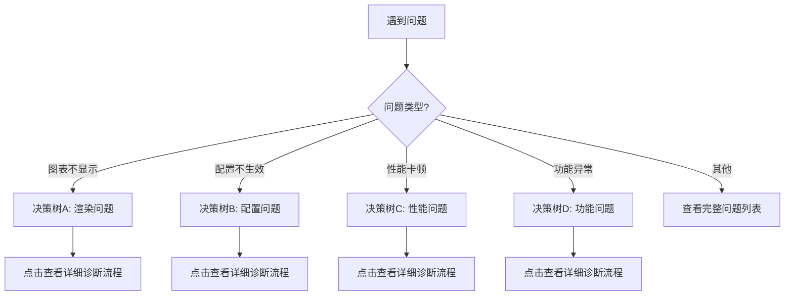
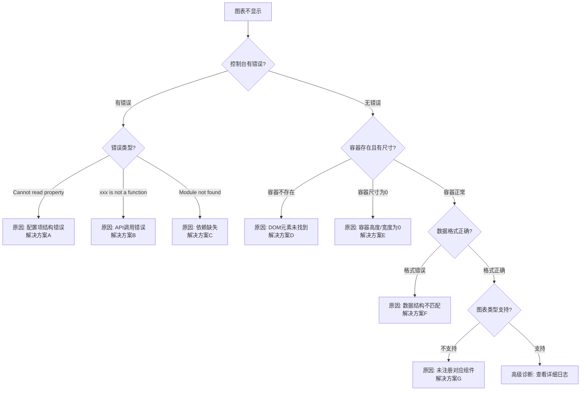
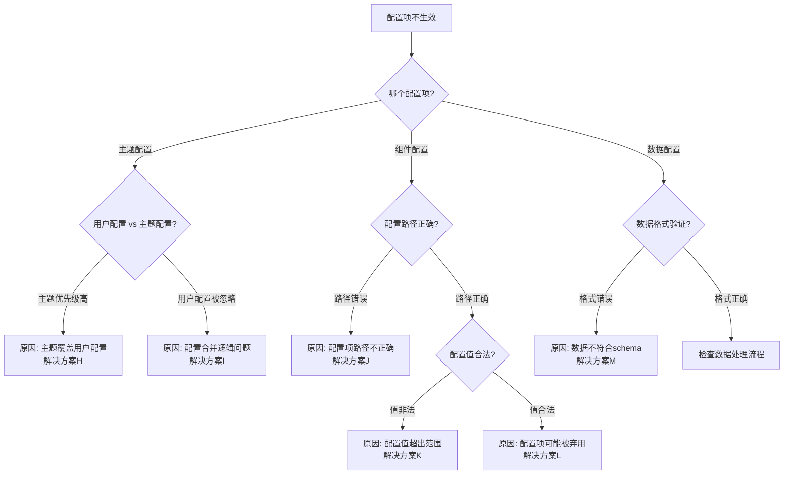
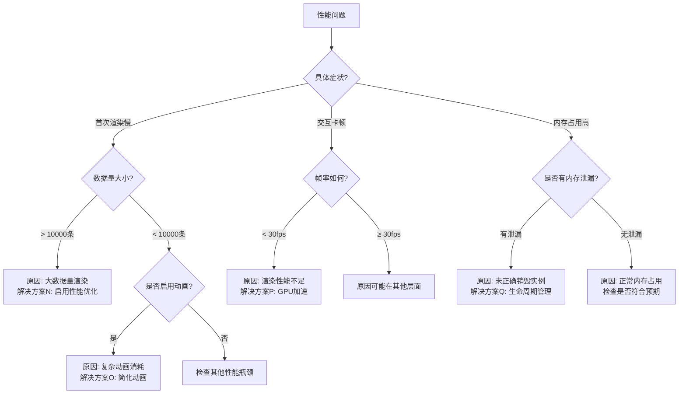

### **故障排查指南 - 决策树模板**

### **简要说明**

通过症状驱动的决策树帮助用户快速诊断和解决常见问题，减少故障排查时间，提升问题解决效率。

### **章节定位**

本模板帮助用户：
- 根据症状快速定位问题根源
- 按照系统化流程进行故障诊断
- 获取针对性的解决方案
- 了解问题的根本原因
- 预防类似问题再次发生

### **适用场景**

- Bug 诊断（功能异常、错误报告）
- 性能问题（渲染慢、内存泄漏、卡顿）
- 配置问题（配置不生效、行为异常）
- 集成问题（与其他系统集成失败）
- 环境问题（兼容性、依赖冲突）

---

## **内容结构**

### 1. 故障排查概述

#### 使用说明
1. 根据你遇到的**症状**进入对应的决策树
2. 按照决策树的引导逐步诊断问题
3. 执行推荐的解决方案
4. 验证问题是否解决
5. 如仍未解决，查看"高级诊断"或提交issue

#### 常见问题分类
- **[高频]** 图表不显示或渲染失败
- **[高频]** 配置项不生效
- **[中频]** 性能问题（卡顿、内存占用高）
- **[中频]** 数据更新不响应
- **[低频]** 主题样式异常
- **[低频]** 事件监听失效

---

### 2. 故障诊断决策树

#### 主决策树：问题分类



---

### 3. 详细诊断流程

#### 决策树A：图表不显示/渲染失败 [高频]



**文本形式**：

```
【图表不显示问题诊断】

第1步: 检查浏览器控制台
├─ 有错误信息？
│  ├─ 是 → 前往第2步
│  └─ 否 → 前往第3步

第2步: 分析错误类型
├─ 错误信息包含 "Cannot read property"？
│  ├─ 是 → 原因: 配置项结构错误 → [解决方案A](#解决方案a配置项结构错误)
│  └─ 否 → 继续
├─ 错误信息包含 "is not a function"？
│  ├─ 是 → 原因: API调用错误 → [解决方案B](#解决方案bapi调用错误)
│  └─ 否 → 继续
└─ 错误信息包含 "Module not found"？
   ├─ 是 → 原因: 依赖缺失 → [解决方案C](#解决方案c依赖缺失)
   └─ 否 → 前往第3步

第3步: 检查容器元素
├─ 容器元素存在？
│  ├─ 否 → [解决方案D](#解决方案d容器不存在)
│  └─ 是 → 继续
├─ 容器宽度/高度 > 0？
│  ├─ 否 → [解决方案E](#解决方案e容器尺寸为0)
│  └─ 是 → 前往第4步

第4步: 检查数据和配置
├─ 数据格式符合要求？
│  ├─ 否 → [解决方案F](#解决方案f数据格式错误)
│  └─ 是 → 继续
└─ 图表类型已正确注册？
   ├─ 否 → [解决方案G](#解决方案g组件未注册)
   └─ 是 → 前往[高级诊断](#高级诊断)
```

---

#### 决策树B：配置项不生效 [高频]



---

#### 决策树C：性能问题 [中频]



---

### 4. 解决方案详解

#### 解决方案A：配置项结构错误

**问题描述**：
控制台报错 `Cannot read property 'xxx' of undefined`，通常是配置项结构不完整导致。

**诊断方法**：
```javascript
// 检查配置项结构
console.log('配置项:', option);

// 常见错误示例
const wrongOption = {
  series: {  // ❌ 应该是数组
    type: 'bar',
    data: [1, 2, 3]
  }
};

const correctOption = {
  series: [{  // ✅ 正确
    type: 'bar',
    data: [1, 2, 3]
  }]
};
```

**解决步骤**：
1. 对照[API文档](#)检查配置项结构
2. 确保数组、对象类型正确
3. 检查必需字段是否缺失
4. 使用 TypeScript 获得类型提示

**验证方法**：
- [ ] 控制台错误消失
- [ ] 图表正常渲染
- [ ] 配置项生效

---

#### 解决方案E：容器尺寸为0

**问题描述**：
容器元素存在但宽度或高度为0，导致图表无法渲染。

**诊断方法**：
```javascript
// 检查容器尺寸
const container = document.getElementById('chart');
console.log('容器尺寸:', {
  width: container.offsetWidth,
  height: container.offsetHeight
});

// 检查CSS样式
console.log('计算样式:', getComputedStyle(container));
```

**常见原因**：
1. 容器未设置高度（height默认为0）
2. 父容器使用 `display: none`
3. 容器在隐藏的tab中
4. CSS未正确加载

**解决步骤**：

**方案1：设置明确的高度**
```css
#chart {
  width: 100%;
  height: 400px; /* 明确指定高度 */
}
```

**方案2：父容器高度处理**
```css
.chart-wrapper {
  height: 100vh; /* 或其他具体值 */
}
```

**方案3：动态显示时重新计算**
```javascript
// 当容器从隐藏变为显示时
chart.resize();
```

**验证方法**：
- [ ] 容器宽度 > 0
- [ ] 容器高度 > 0
- [ ] 图表正常显示

---

#### 解决方案H：主题配置优先级问题

**问题描述**：
用户配置的值被主题配置覆盖，无法生效。

**问题示例**：
```javascript
// v1.11.1 存在的bug
chart.setOption({
  radar: {
    radius: '80%'  // ❌ 被主题配置覆盖
  }
});
```

**解决方案**：

**临时方案**（v1.11.1及以下）：
```javascript
// 方案1: 禁用主题
chart.setOption(option, { theme: null });

// 方案2: 使用更高优先级的配置方式
chart.setOption({
  radar: {
    radius: '80%'
  }
}, true); // notMerge = true
```

**永久方案**（v1.11.2+）：
```javascript
// 已修复，用户配置直接生效
chart.setOption({
  radar: {
    radius: '80%'  // ✅ 正常生效
  }
});
```

**相关信息**：
- 修复版本：v1.11.2
- 相关commit：f31b2bf6
- Issue链接：[#xxx](#)

---

#### 解决方案N：大数据量性能优化

**问题描述**：
数据量超过10000条时，首次渲染时间过长。

**性能优化配置**：

```javascript
const optimizedOption = {
  series: [{
    type: 'scatter',  // 或其他图表类型
    data: largeDataSet,  // > 10000条

    // 性能优化配置
    large: true,                    // 开启大数据量优化
    largeThreshold: 2000,           // 大数据量阈值
    progressive: true,              // 渐进式渲染
    progressiveThreshold: 3000,     // 渐进式阈值
    progressiveChunkMode: 'mod',    // 渐进模式

    // 简化图形样式
    symbolSize: 4,                  // 减小符号大小
    itemStyle: {
      opacity: 0.8
    },

    // 关闭不必要的特性
    animation: false,               // 关闭动画
    emphasis: {
      disabled: true                // 关闭高亮
    }
  }]
};

chart.setOption(optimizedOption);
```

**性能对比**：

| 数据量 | 未优化 | 优化后 | 提升 |
|-------|-------|-------|------|
| 10000 | 2.5s | 0.8s | 68% |
| 50000 | 12s | 2.1s | 82% |
| 100000 | 30s+ | 4.5s | 85% |

**验证方法**：
- [ ] 首次渲染时间 < 2s
- [ ] CPU占用率 < 80%
- [ ] 交互流畅，无明显卡顿

---

### 5. 高级诊断

当常规决策树无法解决问题时，使用以下高级诊断方法：

#### 5.1 启用调试模式

```javascript
// 启用详细日志
paradigmChart.setLogLevel('debug');

// 获取内部状态
const internalState = chart.getModel();
console.log('内部状态:', internalState);

// 监听所有事件
chart.on('*', (params) => {
  console.log('事件触发:', params);
});
```

#### 5.2 性能分析

```javascript
// 使用 Performance API
performance.mark('chart-start');
chart.setOption(option);
performance.mark('chart-end');
performance.measure('chart-render', 'chart-start', 'chart-end');

const measures = performance.getEntriesByType('measure');
console.log('渲染耗时:', measures[0].duration);
```

#### 5.3 内存分析

使用 Chrome DevTools：
1. 打开 Performance 面板
2. 录制一段操作
3. 查看内存曲线
4. 使用 Memory 面板创建堆快照
5. 对比快照查找泄漏对象

---

### 6. 快速参考：问题 → 解决方案映射表

| 问题症状 | 频率 | 可能原因 | 快速解决方案 | 详细方案 |
|---------|------|---------|------------|---------|
| 图表不显示 | 高频 | 容器尺寸为0 | 设置容器高度 | [方案E](#解决方案e容器尺寸为0) |
| 图表不显示 | 高频 | 配置结构错误 | 检查配置格式 | [方案A](#解决方案a配置项结构错误) |
| 配置不生效 | 高频 | 主题覆盖 | 升级到v1.11.2+ | [方案H](#解决方案h主题配置优先级问题) |
| 渲染很慢 | 中频 | 大数据量 | 启用性能优化 | [方案N](#解决方案n大数据量性能优化) |
| 内存占用高 | 中频 | 未销毁实例 | 正确调用dispose | [方案Q](#) |
| 样式异常 | 低频 | 主题冲突 | 检查主题配置 | [方案X](#) |

---

### 7. 预防性措施

#### 开发阶段
- [ ] 使用 TypeScript 获得类型检查
- [ ] 启用 ESLint 规则检查
- [ ] 编写单元测试覆盖关键配置
- [ ] 使用性能监控工具

#### 测试阶段
- [ ] 测试不同数据量场景
- [ ] 测试不同浏览器兼容性
- [ ] 进行内存泄漏检测
- [ ] 压力测试

#### 生产阶段
- [ ] 启用错误监控（Sentry等）
- [ ] 收集用户反馈
- [ ] 定期review性能指标
- [ ] 保持依赖版本更新

---

### 8. 获取帮助

如果以上方法都无法解决问题：

#### 提交Issue前检查清单
- [ ] 已搜索现有issue
- [ ] 已查看文档和FAQ
- [ ] 已尝试最新版本
- [ ] 已准备最小可复现示例

#### Issue模板
```markdown
### 环境信息
- paradigm-chart版本: v1.x.x
- 浏览器: Chrome 120
- 操作系统: Windows 10

### 问题描述
简要描述问题

### 复现步骤
1. 第一步
2. 第二步
3. ...

### 预期行为
应该如何

### 实际行为
实际如何

### 最小可复现示例
[CodePen/JSFiddle 链接]

### 相关日志
```
控制台错误信息
```
```

#### 联系方式
- GitHub Issues: [链接]
- 社区论坛: [链接]
- 技术支持: [邮箱]

---

### 元数据

- **模板版本**：v1.0
- **最后更新**：{UPDATE_DATE}
- **适用产品**：{PRODUCT_NAME} v1.11.2+
- **维护团队**：{TEAM_NAME}
