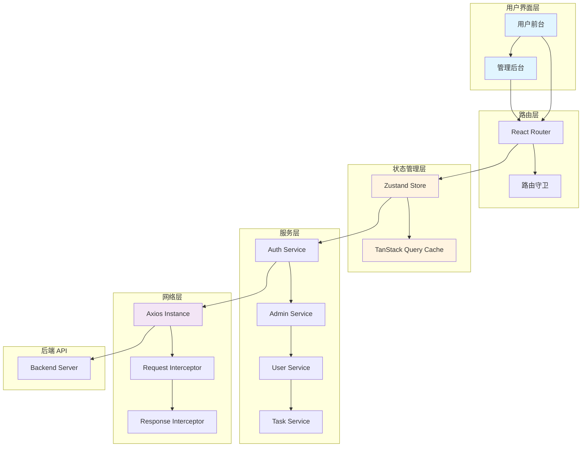
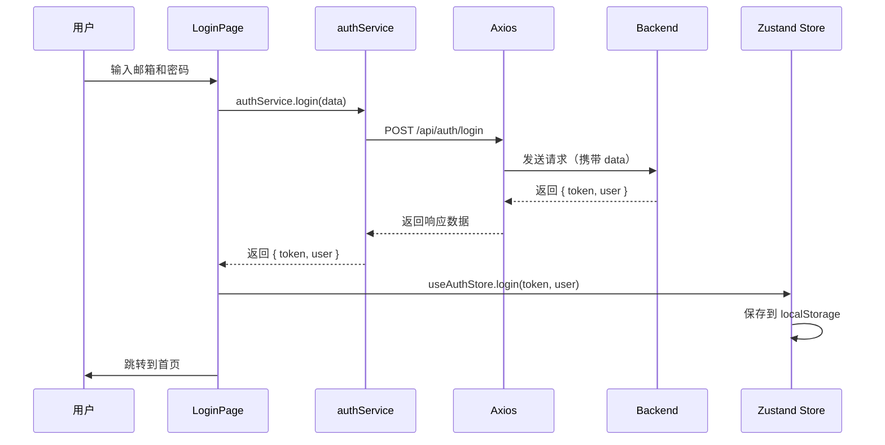
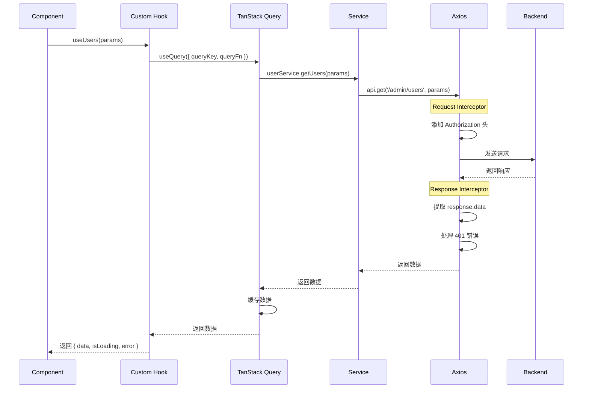
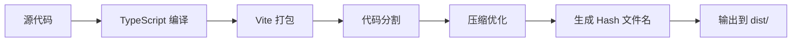

# 技术架构

## 简要说明

本文档详细介绍 Mirage 项目的技术架构设计、模块划分、数据流向和核心机制，帮助开发者深入理解系统的运行机制。

## 整体架构图



## 分层架构设计

### 1. 表现层（Presentation Layer）

**职责**：
- 渲染用户界面
- 处理用户交互
- 展示数据和状态

**核心组件**：

| 目录 | 说明 |
|------|------|
| `src/pages/` | 页面组件（路由级） |
| `src/components/` | 可复用组件 |
| `src/layouts/` | 布局组件 |

**设计特点**：
- 组件化开发，基于 **Radix UI** 构建
- 使用 **Tailwind CSS** 进行样式管理
- 支持响应式布局

### 2. 路由层（Routing Layer）

**职责**：
- 管理应用路由
- 实现路由守卫和权限控制
- 支持懒加载和代码分割

**核心文件**：`src/config/routes.tsx`

**路由结构**：

```typescript
// 管理后台路由
/wadminw
  ├── /login              # 管理员登录
  └── /wadminw/*          # 需要 AdminGuard 保护
      ├── /dashboard      # 数据概览
      ├── /users          # 用户管理
      ├── /cdk            # CDK 管理
      ├── /keys           # 密钥池管理
      ├── /model-configs  # 模型配置
      ├── /models         # 模型管理
      └── /playground     # 测试平台

// 用户前台路由
/
  ├── /login              # 用户登录
  ├── /register           # 用户注册
  └── /*                  # 用户前台
      ├── /               # 首页
      ├── /models         # 模型广场
      ├── /explore/*      # 探索功能
      ├── /playground/*   # 对话/视频生成
      ├── /setting/*      # 用户设置
      └── /more/*         # 更多内容
```

**路由守卫机制**：

```typescript
// AdminGuard 组件保护管理后台
<AdminGuard>
  <AdminLayout />
</AdminGuard>
```

### 3. 状态管理层（State Management Layer）

**职责**：
- 管理全局状态
- 缓存服务器数据
- 同步和异步状态管理

**技术选型**：

| 工具 | 用途 | 特点 |
|------|------|------|
| **Zustand** | 全局状态管理 | 轻量、简洁、TypeScript 友好 |
| **TanStack Query** | 服务器状态管理 | 自动缓存、重新验证、后台更新 |

**Zustand 状态管理示例**：

```typescript
// src/store/authStore.ts
interface AuthState {
  token: string | null;
  user: AuthUser | null;
  isAuthenticated: boolean;

  login: (token: string, user: AuthUser) => void;
  logout: () => void;
  setUser: (user: AuthUser) => void;
}

export const useAuthStore = create<AuthState>()(
  persist(
    (set) => ({
      token: null,
      user: null,
      isAuthenticated: false,

      login: (token, user) => {
        localStorage.setItem('auth_token', token);
        set({ token, user, isAuthenticated: true });
      },

      logout: () => {
        localStorage.removeItem('auth_token');
        set({ token: null, user: null, isAuthenticated: false });
      },

      setUser: (user) => set({ user }),
    }),
    { name: 'auth-storage' }
  )
);
```

**TanStack Query 数据请求示例**：

```typescript
// 自定义 Hook
export function useUsers(params: UserQueryParams) {
  return useQuery({
    queryKey: ['users', params],
    queryFn: () => userService.getUsers(params),
    staleTime: 5 * 60 * 1000, // 5 分钟
  });
}
```

### 4. 服务层（Service Layer）

**职责**：
- 封装 API 调用逻辑
- 提供统一的数据接口
- 处理请求参数和响应数据

**目录结构**：

```
src/services/
├── admin/
│   ├── dashboard.ts     # 数据概览 API
│   ├── users.ts         # 用户管理 API
│   ├── cdk.ts           # CDK 管理 API
│   └── ...
├── auth.ts              # 认证 API
└── tasks.ts             # 任务 API
```

**服务封装模式**：

```typescript
// src/services/auth.ts
export const authService = {
  // 发送邮箱验证码
  sendCode: async (data: SendCodeRequest) => {
    return api.post<ApiResponse<void>>('/auth/code', data);
  },

  // 用户注册
  register: async (data: RegisterRequest) => {
    const response = await api.post<ApiResponse<RegisterResponse>>(
      '/auth/register',
      data
    );
    return response.data;
  },

  // 用户登录
  login: async (data: LoginRequest) => {
    const response = await api.post<ApiResponse<LoginResponse>>(
      '/auth/login',
      data
    );
    return response.data;
  },
};
```

### 5. 网络层（Network Layer）

**职责**：
- 管理 HTTP 请求
- 统一请求/响应拦截
- 处理认证和错误

**核心文件**：`src/lib/api.ts`

**Axios 实例配置**：

```typescript
const api = axios.create({
  baseURL: '/api',
  timeout: 10000,
  headers: {
    'Content-Type': 'application/json',
  },
});
```

**请求拦截器**：

```typescript
api.interceptors.request.use(
  (config) => {
    // 自动添加 JWT Token
    const token = localStorage.getItem('auth_token');
    if (token) {
      config.headers.Authorization = `Bearer ${token}`;
    }
    return config;
  },
  (error) => Promise.reject(error)
);
```

**响应拦截器**：

```typescript
api.interceptors.response.use(
  (response) => {
    // 自动提取 data 字段
    return response.data;
  },
  (error) => {
    // 401 未授权处理
    if (error.response?.status === 401) {
      localStorage.removeItem('auth_token');

      // 根据路径跳转到对应登录页
      if (window.location.pathname.startsWith('/wadminw')) {
        window.location.href = '/wadminw/login';
      } else {
        window.location.href = '/login';
      }
    }

    // 统一错误格式
    return Promise.reject({
      message: error.response?.data?.message || error.message,
      status: error.response?.status,
    });
  }
);
```

## 模块拆解

### 认证模块（Authentication Module）

**核心职责**：
- 用户登录/注册
- Token 管理
- 权限验证

**输入与输出**：

| 操作 | 输入 | 输出 |
|------|------|------|
| 登录 | email, password | token, user |
| 注册 | email, code, password | user_id |
| 获取用户信息 | token | user |
| 登出 | token | void |

**关键 API**：

- `POST /api/auth/login` - 用户登录
- `POST /api/auth/register` - 用户注册
- `POST /api/auth/code` - 发送验证码
- `GET /api/auth/me` - 获取当前用户信息
- `POST /api/auth/logout` - 用户登出

**与其他模块关系**：
- 为所有需要认证的模块提供 Token
- 通过 Axios 拦截器自动注入 Token
- 通过路由守卫控制页面访问权限

### 用户管理模块（User Management Module）

**核心职责**：
- 管理用户列表
- 编辑用户信息
- 管理用户余额和等级

**输入与输出**：

| 操作 | 输入 | 输出 |
|------|------|------|
| 获取用户列表 | page, page_size, filters | users[], total |
| 更新用户 | user_id, updates | updated_user |
| 充值余额 | user_id, amount | new_balance |

**关键组件**：

- `UserManager.tsx` - 用户管理页面
- `UserEditDialog.tsx` - 用户编辑对话框
- `UserBalanceDialog.tsx` - 余额充值对话框
- `StatusBadge.tsx` - 用户状态徽章
- `LevelBadge.tsx` - 用户等级徽章

### CDK 管理模块（CDK Management Module）

**核心职责**：
- 生成 CDK 兑换码
- 管理 CDK 状态
- 导出 CDK 数据

**输入与输出**：

| 操作 | 输入 | 输出 |
|------|------|------|
| 生成 CDK | type, amount, count | cdks[] |
| 查询 CDK | page, filters | cdks[], total |
| 删除 CDK | cdk_id | void |

**关键组件**：

- `CDKManager.tsx` - CDK 管理页面
- `CDKGenerateForm.tsx` - CDK 生成表单
- `CDKTable.tsx` - CDK 数据表格

### 数据统计模块（Dashboard Module）

**核心职责**：
- 展示平台数据统计
- 用户增长趋势
- Token 使用情况

**输入与输出**：

| 操作 | 输入 | 输出 |
|------|------|------|
| 获取概览数据 | - | stats |
| 获取用户增长 | date_range | growth_data[] |
| 获取 Token 使用 | date_range | usage_data[] |

**关键组件**：

- `Dashboard.tsx` - 数据概览页面
- `UserGrowthChart.tsx` - 用户增长图表
- `TokenUsageChart.tsx` - Token 使用图表

## 数据流向

### 用户登录流程



### API 请求流程



## 构建系统说明

### Vite 构建流程



**构建阶段**：

1. **TypeScript 类型检查**：`tsc -b`
2. **Vite 打包**：使用 Rollup 进行打包
3. **代码分割**：自动按路由分割
4. **资源优化**：压缩 JS/CSS，优化图片
5. **生成产物**：输出到 `dist/` 目录

**关键配置**：

```typescript
// vite.config.ts
export default defineConfig({
  plugins: [react()],
  resolve: {
    alias: {
      "@": path.resolve(__dirname, "./src"),
    },
  },
  server: {
    proxy: {
      '/api': {
        target: 'http://localhost:5000',
        changeOrigin: true,
      },
    },
  },
});
```

## 样式架构

### Tailwind CSS 集成

**技术方案**：
- **Tailwind CSS**：原子化 CSS 框架
- **PostCSS**：CSS 后处理器
- **class-variance-authority**：变体管理
- **tailwind-merge**：类名合并去重
- **clsx**：条件类名

**样式组织**：

```typescript
// 使用 CVA 定义变体
const buttonVariants = cva(
  "inline-flex items-center justify-center rounded-md",
  {
    variants: {
      variant: {
        default: "bg-primary text-primary-foreground",
        outline: "border border-input bg-background",
      },
      size: {
        default: "h-10 px-4 py-2",
        sm: "h-9 rounded-md px-3",
        lg: "h-11 rounded-md px-8",
      },
    },
  }
);
```

### Radix UI 组件体系

**设计理念**：
- **无样式组件**：Radix UI 提供功能，Tailwind 提供样式
- **可访问性**：符合 WAI-ARIA 标准
- **组合式设计**：组件可灵活组合

**常用组件**：

| 组件 | 用途 |
|------|------|
| Dialog | 对话框 |
| Dropdown Menu | 下拉菜单 |
| Select | 选择器 |
| Table | 数据表格 |
| Toast | 消息通知 |
| Form | 表单 |

## Mock 数据架构

### MSW (Mock Service Worker)

**工作原理**：
- 在浏览器中拦截网络请求
- 返回 Mock 数据
- 不影响真实网络请求

**配置示例**：

```typescript
// src/mocks/browser.ts
import { setupWorker } from 'msw/browser';
import { handlers } from './handlers';

export const worker = setupWorker(...handlers);

// 启动 Mock
if (process.env.NODE_ENV === 'development') {
  worker.start();
}
```

**Handler 定义**：

```typescript
// src/mocks/handlers/user.ts
export const userHandlers = [
  http.get('/api/admin/users', () => {
    return HttpResponse.json({
      success: true,
      data: mockUsers,
    });
  }),
];
```

## 扩展方式

### 添加新页面

1. 在 `src/pages/` 下创建页面组件
2. 在 `src/config/routes.tsx` 中添加路由
3. 如需认证，添加路由守卫

### 添加新 API

1. 在 `src/services/` 中定义服务函数
2. 在 `src/types/` 中定义类型
3. 在 `src/hooks/` 中创建自定义 Hook
4. 使用 TanStack Query 进行数据请求

### 添加新组件

1. 在 `src/components/` 中创建组件
2. 使用 Tailwind CSS 和 Radix UI 进行样式和功能实现
3. 导出组件供其他模块使用

## 相关链接

- [核心概念](./04-核心概念.md) - 理解设计理念和关键概念
- [API 文档](./05-API文档.md) - 查看后端接口文档
