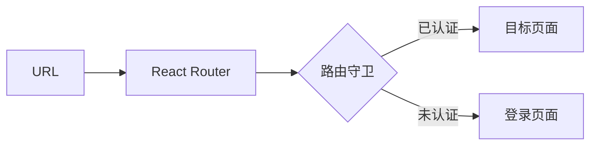
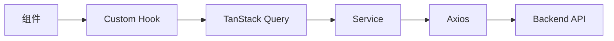
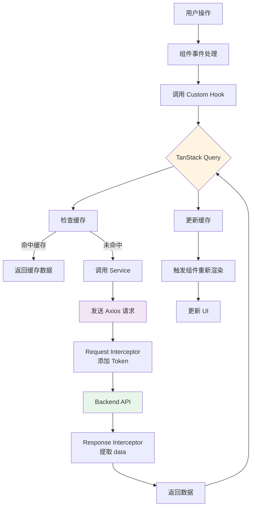
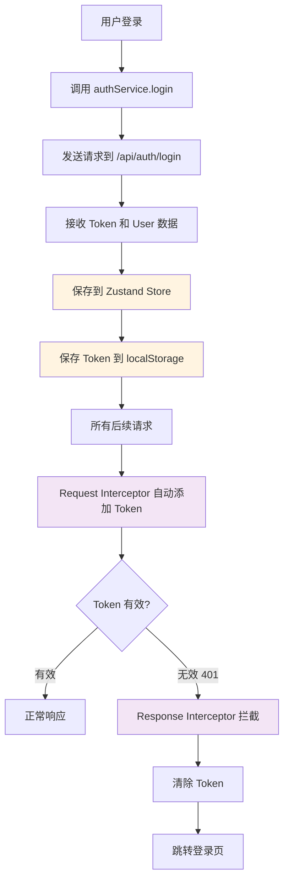
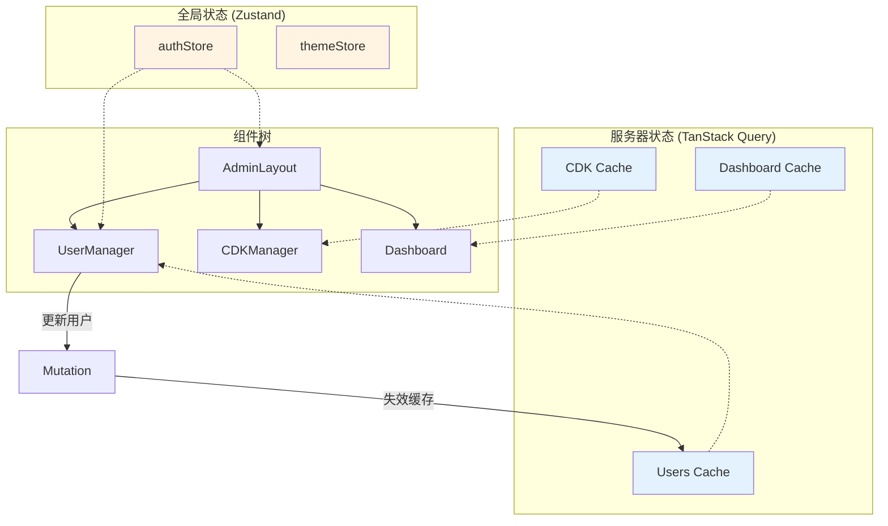

# 核心概念

## 简要说明

本文档介绍 Mirage 项目的设计理念和核心概念，帮助开发者理解系统"为什么这样设计"，以及关键概念之间的关系。

## 设计哲学

### 分离关注点（Separation of Concerns）

Mirage 采用**清晰的分层架构**，将不同职责的代码分离到不同的层次：

- **表现层**：只负责 UI 渲染和用户交互
- **状态管理层**：管理应用状态和服务器缓存
- **服务层**：封装 API 调用逻辑
- **网络层**：处理 HTTP 请求和响应

**优势**：
- 代码职责清晰，易于维护
- 模块之间低耦合，易于测试
- 便于团队协作开发

### 声明式编程（Declarative Programming）

使用 **React** 的声明式特性，关注"**是什么**"而不是"**怎么做**"：

```typescript
// 声明式：描述 UI 应该是什么样子
function UserList({ users }) {
  return (
    <div>
      {users.map(user => (
        <UserCard key={user.id} user={user} />
      ))}
    </div>
  );
}
```

**优势**：
- 代码可读性强
- 易于推理和调试
- 减少状态管理复杂度

### 组件化（Component-Based）

将 UI 拆分为**可复用的组件**，构建组件树：

```
AdminLayout
├── AdminHeader
│   ├── UserMenu
│   └── NotificationBell
├── AdminSidebar
│   └── NavMenu
└── Outlet (页面内容)
    └── UserManager
        ├── UserTable
        ├── UserEditDialog
        └── UserBalanceDialog
```

**优势**：
- 组件可复用，减少重复代码
- 易于维护和测试
- 支持按需加载

### 类型安全（Type Safety）

使用 **TypeScript** 提供编译时类型检查：

```typescript
// 接口定义
interface User {
  id: number;
  email: string;
  name: string;
  balance: number;
  level: UserLevel;
  status: UserStatus;
}

// 类型安全的函数
function updateUser(userId: number, updates: Partial<User>): Promise<User> {
  return api.put<User>(`/admin/users/${userId}`, updates);
}
```

**优势**：
- 编译时发现错误，减少运行时 bug
- 提供智能提示和自动补全
- 代码重构更安全

## 核心概念拆解

### 1. 路由（Routing）

**定义**：路由是 URL 路径与组件之间的映射关系。

**作用**：
- 控制页面导航
- 管理应用状态（通过 URL）
- 实现权限控制

**与系统的关系**：



**使用示例**：

```typescript
// 定义路由
{
  path: '/wadminw',
  element: (
    <AdminGuard>
      <AdminLayout />
    </AdminGuard>
  ),
  children: [
    { path: 'dashboard', element: <Dashboard /> },
    { path: 'users', element: <UserManager /> },
  ],
}
```

### 2. 状态管理（State Management）

**定义**：管理应用中的数据状态，包括本地状态和服务器状态。

**作用**：
- 集中管理全局状态
- 同步组件间的数据
- 缓存服务器数据

**状态分类**：

| 状态类型 | 工具 | 示例 |
|---------|------|------|
| **全局状态** | Zustand | 用户认证信息、主题设置 |
| **服务器状态** | TanStack Query | 用户列表、CDK 数据 |
| **本地状态** | useState | 表单输入、对话框开关 |

**使用示例**：

```typescript
// Zustand：全局状态
const { user, login } = useAuthStore();

// TanStack Query：服务器状态
const { data: users, isLoading } = useUsers({ page: 1 });

// useState：本地状态
const [isOpen, setIsOpen] = useState(false);
```

### 3. 服务（Service）

**定义**：封装 API 调用逻辑的函数集合。

**作用**：
- 统一 API 调用接口
- 提供类型安全
- 简化组件代码

**与系统的关系**：



**使用示例**：

```typescript
// 定义服务
export const userService = {
  getUsers: async (params: UserQueryParams) => {
    return api.get<ApiResponse<UserListResponse>>('/admin/users', { params });
  },

  updateUser: async (userId: number, data: Partial<User>) => {
    return api.put<ApiResponse<User>>(`/admin/users/${userId}`, data);
  },
};

// 在组件中使用
const { data } = useQuery({
  queryKey: ['users', params],
  queryFn: () => userService.getUsers(params),
});
```

### 4. 拦截器（Interceptor）

**定义**：在请求发送前或响应返回后执行的函数。

**作用**：
- 自动添加认证 Token
- 统一处理响应数据
- 全局错误处理

**请求拦截器示例**：

```typescript
api.interceptors.request.use(
  (config) => {
    // 自动添加 JWT Token
    const token = localStorage.getItem('auth_token');
    if (token) {
      config.headers.Authorization = `Bearer ${token}`;
    }
    return config;
  }
);
```

**响应拦截器示例**：

```typescript
api.interceptors.response.use(
  (response) => {
    // 自动提取 data 字段
    return response.data;
  },
  (error) => {
    // 401 自动跳转登录
    if (error.response?.status === 401) {
      localStorage.removeItem('auth_token');
      window.location.href = '/login';
    }
    return Promise.reject(error);
  }
);
```

### 5. 自定义 Hook（Custom Hook）

**定义**：封装可复用逻辑的 React Hook。

**作用**：
- 复用业务逻辑
- 简化组件代码
- 提供类型安全

**使用示例**：

```typescript
// 定义 Hook
export function useUsers(params: UserQueryParams) {
  return useQuery({
    queryKey: ['users', params],
    queryFn: () => userService.getUsers(params),
    staleTime: 5 * 60 * 1000,
  });
}

// 在组件中使用
function UserManager() {
  const [params, setParams] = useState({ page: 1 });
  const { data, isLoading, error } = useUsers(params);

  // ...
}
```

### 6. 数据缓存（Data Caching）

**定义**：将服务器数据缓存到客户端，减少网络请求。

**作用**：
- 提升用户体验（快速响应）
- 减少服务器负载
- 支持离线访问

**TanStack Query 缓存机制**：

```typescript
useQuery({
  queryKey: ['users', params],
  queryFn: () => userService.getUsers(params),

  // 缓存配置
  staleTime: 5 * 60 * 1000,      // 5 分钟内数据视为新鲜
  cacheTime: 10 * 60 * 1000,     // 10 分钟后清除缓存
  refetchOnWindowFocus: true,    // 窗口聚焦时重新获取
});
```

**缓存更新策略**：

| 策略 | 说明 | 使用场景 |
|------|------|---------|
| **乐观更新** | 先更新 UI，再发送请求 | 点赞、收藏 |
| **重新验证** | 后台重新获取数据 | 用户列表 |
| **手动失效** | 手动标记缓存失效 | 数据修改后 |

### 7. 表单管理（Form Management）

**定义**：使用 React Hook Form + Zod 进行表单状态管理和验证。

**作用**：
- 简化表单状态管理
- 提供声明式验证
- 支持类型推导

**使用示例**：

```typescript
// 定义验证 Schema
const loginSchema = z.object({
  email: z.string().email('邮箱格式不正确'),
  password: z.string().min(6, '密码至少 6 位'),
});

type LoginForm = z.infer<typeof loginSchema>;

// 使用表单
function LoginPage() {
  const form = useForm<LoginForm>({
    resolver: zodResolver(loginSchema),
    defaultValues: {
      email: '',
      password: '',
    },
  });

  const onSubmit = (data: LoginForm) => {
    // data 已通过验证，类型安全
    authService.login(data);
  };

  return (
    <Form {...form}>
      <form onSubmit={form.handleSubmit(onSubmit)}>
        <FormField name="email" />
        <FormField name="password" />
        <Button type="submit">登录</Button>
      </form>
    </Form>
  );
}
```

### 8. 组件变体（Component Variants）

**定义**：使用 `class-variance-authority` 定义组件的不同样式变体。

**作用**：
- 统一组件样式管理
- 支持多种视觉变体
- 类型安全的样式选择

**使用示例**：

```typescript
// 定义按钮变体
const buttonVariants = cva(
  "inline-flex items-center justify-center rounded-md",
  {
    variants: {
      variant: {
        default: "bg-primary text-primary-foreground",
        destructive: "bg-destructive text-destructive-foreground",
        outline: "border border-input bg-background",
      },
      size: {
        default: "h-10 px-4 py-2",
        sm: "h-9 px-3",
        lg: "h-11 px-8",
      },
    },
    defaultVariants: {
      variant: "default",
      size: "default",
    },
  }
);

// 使用变体
<Button variant="outline" size="lg">点击我</Button>
```

## 概念之间的关系

### 完整的数据流



### 认证流程



### 组件通信机制



## 设计模式应用

### 1. 容器/展示模式（Container/Presentational Pattern）

**容器组件**：处理逻辑和数据
**展示组件**：只负责渲染

```typescript
// 容器组件
function UserManagerContainer() {
  const { data, isLoading } = useUsers();
  const updateMutation = useUpdateUser();

  return (
    <UserManagerView
      users={data}
      isLoading={isLoading}
      onUpdate={updateMutation.mutate}
    />
  );
}

// 展示组件
function UserManagerView({ users, isLoading, onUpdate }) {
  return (
    <div>
      {isLoading ? <Skeleton /> : <UserTable users={users} />}
    </div>
  );
}
```

### 2. 组合模式（Composition Pattern）

使用组合而非继承：

```typescript
// 使用 children 进行组合
<Dialog>
  <DialogTrigger>打开</DialogTrigger>
  <DialogContent>
    <DialogHeader>
      <DialogTitle>标题</DialogTitle>
    </DialogHeader>
    <DialogDescription>内容</DialogDescription>
  </DialogContent>
</Dialog>
```

### 3. 单一职责原则（Single Responsibility Principle）

每个模块只负责一件事：

- `src/services/` - 只负责 API 调用
- `src/hooks/` - 只负责封装逻辑
- `src/components/` - 只负责 UI 渲染

## 最佳实践

### 状态管理最佳实践

1. **优先使用服务器状态**：用 TanStack Query 管理来自服务器的数据
2. **本地状态尽量下沉**：只在需要的组件中使用 `useState`
3. **全局状态谨慎使用**：只用于真正全局的状态（如用户认证）

### API 调用最佳实践

1. **统一使用 Service 层**：不要在组件中直接调用 axios
2. **使用 Custom Hook 封装**：提供更好的类型安全和复用性
3. **合理设置缓存策略**：平衡性能和数据新鲜度

### 组件设计最佳实践

1. **保持组件简洁**：一个组件不超过 200 行
2. **提取可复用逻辑**：使用 Custom Hook
3. **合理使用组合**：优先组合而非继承

## 相关链接

- [技术架构](./03-技术架构.md) - 查看系统架构设计
- [API 文档](./05-API文档.md) - 查看后端接口文档
